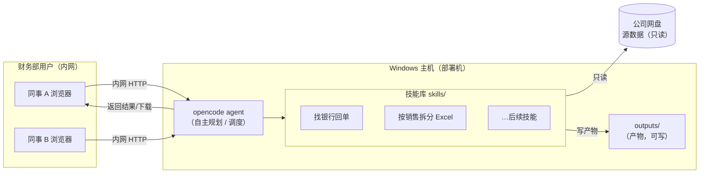

# 财务部 AI 助手平台

> 本仓库当前阶段：**只搭骨架与文档，不写业务功能代码。** 具体的"找回单 / 拆 Excel"实现留待后续。

## 一、项目目标

为甲骨易财务部搭建一个基于 **agent（智能体）** 的 AI 助手平台。它不是一条写死的固定流程，而是一个能够**自主规划、按需调用技能、读取公司网盘数据**的助手：财务同事用自然语言提出诉求，agent 自己判断该调哪个技能、读哪些数据、产出什么结果。

- **开发者（李明昊）**：搭建、维护技能与平台。
- **财务同事**：日常使用；培训后可做小幅调整。

首批要支持的两个流程：

1. **按客户名找银行回单** —— 在网盘里检索指定客户的银行回单并导出。
2. **按销售人员拆分 Excel** —— 把汇总表按销售人员拆成单独文件。

## 二、架构设想

平台部署在公司一台 **Windows 主机**上，财务部多人通过**公司内网用浏览器访问**。核心是 opencode agent，它挂载若干**技能（skills）**，对接**公司网盘（只读）**，把所有产物写入独立的 `outputs/` 目录。

## 三、部署目标

- **环境**：公司一台 Windows 主机。
- **访问方式**：公司内网，浏览器访问，财务部多人共用。
- **不出网**：数据与处理全部在内网完成，敏感数据不外传。

## 四、数据安全底线（红线）

1. **源数据只读**：对公司网盘 / 源文件**绝不修改、移动、删除**，只读取。
2. **产物隔离**：所有结果一律写入独立的 `outputs/` 目录，不回写源目录。
3. **敏感数据不进仓库**：真实数据、密钥、本地配置不提交 git（见 `.gitignore`）。
4. **内网为主**：默认不连外网处理敏感数据。

## 五、目录说明

| 目录 / 文件 | 用途 |
|-------------|------|
| `README.md` | 本文件：目标、架构、部署、安全底线 |
| `docs/需求与边界.md` | 做什么 / 不做什么、用户与角色职责 |
| `docs/技能清单.md` | 规划中的技能一览表 |
| `skills/` | 每个技能一个子目录（当前为空，留 `.gitkeep`） |
| `inputs/` | 数据进入口；约定**只读**对待源数据 |
| `outputs/` | 所有产物输出处；**唯一可写**的数据目录 |
| `.gitignore` | 忽略敏感数据、密钥、本地配置 |
