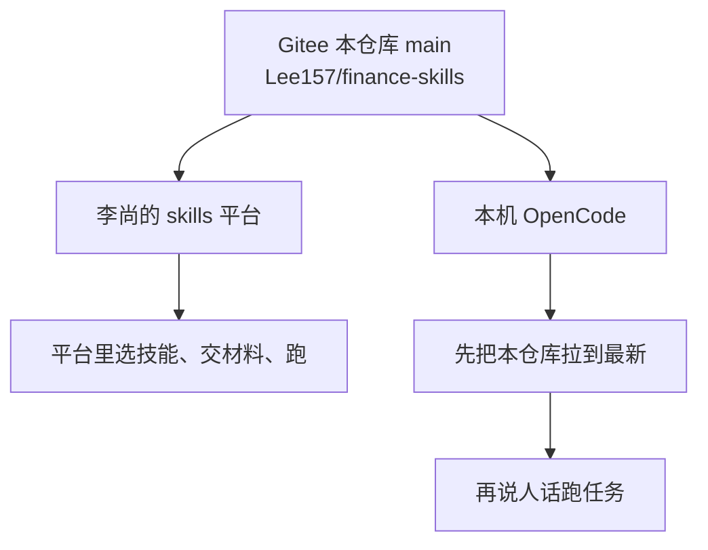

# 财务部 skills

一件活一个夹，都在 `skills/`。

## 更新去哪（默认 Gitee）

同事或 Agent 听到 **「更新财务部skills / 更新财务skills / 拉最新财务技能」**，**只从 Gitee 拉，不要去 GitHub。**

| | |
|--|--|
| 仓库 | https://gitee.com/Lee157/finance-skills |
| 分支 | `main` |
| git | `https://gitee.com/Lee157/finance-skills.git` |

本机已装过：把 opencode 里这份仓 `git fetch` + `git pull` 到 `origin/main`（remote 若不是 Gitee，先改成上面这个地址再 pull）。只更新 `pack.json` 白名单里的技能夹；本机 `config/` 默认留着（核销跟仓库走）。不要清空同事自己装的其它 skill。

没装过：`git clone https://gitee.com/Lee157/finance-skills.git`，再把 `skills/` 拷进 opencode skills 目录。

跑任务只有两条路，不要混：

```mermaid
flowchart TD
  R["Gitee 本仓库 main<br/>Lee157/finance-skills"]
  R --> P["李尚的 skills 平台"]
  R --> O["本机 OpenCode"]
  P --> P1["平台里选技能、交材料、跑"]
  O --> O1["先把本仓库拉到最新"]
  O1 --> O2["再说人话跑任务"]
```

- **走平台**：李尚那边接这份仓库。同事在平台上点技能、上传表、看结果。不要再在 OpenCode 里跑同一趟。
- **走 OpenCode**：先按上面从 **Gitee `main`** 拉到最新，再按[技能表](#技能表)开口。没拉新，跑的就是旧的。

本机已经有的账密 json **不要再问**。没有才让她写一次，不要把密码打进对话。

## 版本

每个 skill 的 `SKILL.md` 里有 `version`。这次起业务 skill 是 **1.1**。

改某个 `skills/<id>/` 的脚本、config 或 SKILL.md，只给那一个 +0.1，并改本表。没改的不要动版本。测绿后 `git push gitee main`。

## 技能表

按使用人排。名称后括号是谁用。

### 亮晶

| 名称 | id | version | 简介 | 需要提供 |
|------|----|---------|------|----------|
| 应收账款合并（亮晶） | receivables-merge | 1.1 | 分年表合成应收 all，带催收参考和透视 | Excel：本周源台账；最好再给上版应收 all |
| 应收按销售拆分（亮晶） | split-by-sales | 1.1 | 一张 all 拆成一人一份 | Excel：一张应收 all |
| 劳务发票核对（亮晶） | labor-invoice-check | 1.1 | 有票 / 800 以下 / 无票 | Excel：应发明细 + 当月个人发票汇总 |
| 九点下单统计（亮晶） | order-daily-summary | 1.1 | 下单数据（万元） | 智云账号密码；或离线：九点下单明细 Excel |
| 追觅应收进度对比（亮晶） | dreame-ar-progress-diff | 1.1 | 两版追觅 list 的进度差 | Excel：两版追觅应收 list |

### 明妹

| 名称 | id | version | 简介 | 需要提供 |
|------|----|---------|------|----------|
| 应收核销日清（明妹） | ar-hexiao-daily | 1.1 | 智云取数、判定、写盈亏和流转副本 | 智云账号密码；Excel：年度盈亏核算表 + 到账流转表 |

### 斯佳

| 名称 | id | version | 简介 | 需要提供 |
|------|----|---------|------|----------|
| 金蝶入账（斯佳） | kingdee-posting | 1.4 | 销项 / 收款填引入表，人去点引入 | 金蝶开放平台应用 ID/密钥。销项/收款另要金蝶网页账密。收款：中行收款 Excel；销售空了才要智云账号 |
| 供应商付款入金蝶（斯佳） | kingdee-payment | 1.1 | 付款台账+发票 PDF 填引入表 | 金蝶开放平台 + 网页账密。台账 Excel + 各家发票夹。不要说「金蝶入账」那句 |
| 月度损益表（斯佳） | pl-dept-report | 1.1 | 星辰多账套拼损益表和利润表 | 金蝶网页账密 + 开放平台应用 ID/密钥。山东/四川/济南：代账利润表 Excel。薪酬台账 Excel 有就给 |
| 序时账入金蝶（斯佳） | kingdee-gl-import | 1.1 | 序时账转官方引入表 | Excel：序时账。不要金蝶/智云账密 |
| 部门费用归集分摊（斯佳） | dept-expense-alloc | 1.1 | 用友按人拆部门费用 | Excel：用友余额表、收入底稿、人员归属、按人明细（工资社保有就给） |
| 合并报表（斯佳） | consolidated-statements | 1.1 | 八主体资负利润现金流底稿 | 会计月份 YYYYMM。从金蝶拉：金蝶网页账密（五个星辰账套）。山东/四川/济南：人放公司报表 Excel |
| 代扣代缴申报表重命名（斯佳） | withholding-report-rename | 1.1 | 申报 PDF 按公司名+金额改名 | PDF：代扣代缴申报表一夹。不要账密 |

### 通用

| 名称 | id | version | 简介 | 需要提供 |
|------|----|---------|------|----------|
| Excel（通用） | xlsx | 1.1 | 读写和整理表格 | 要改的 Excel |
| Word（通用） | docx | 1.1 | 读写 Word | 要改的 Word |
| PPT（通用） | pptx | 1.1 | 读写演示文稿 | 要改的 PPT |
| PDF（通用） | pdf | 1.1 | 读、拆、合并 PDF | 要处理的 PDF |

已下线：`qige-invoice-to-kingdee`（销项已在金蝶入账）、`task-clarifier`、`update-finance-skills`、`env-doctor`、`compliance-spot-check`（合规抽查过期，后续另做）。

## 仓库

更新默认仓库就是上面这个 Gitee，不要写 GitHub。开发测绿后 `git push gitee main`。真表、口令、客户明细不进仓。
