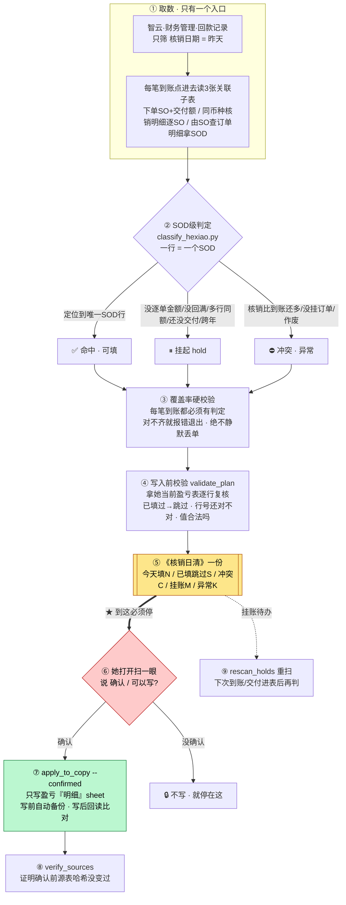
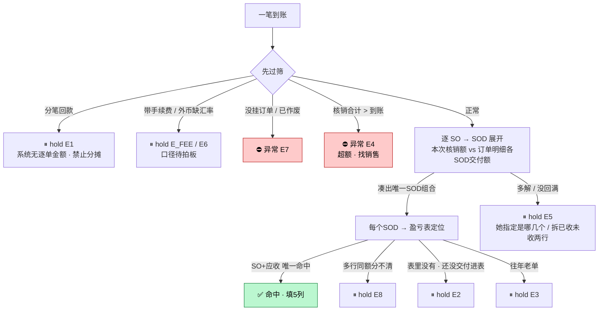

# 应收核销日清（ar-hexiao-daily）

> 出纳每天 T-1 回款核销：**智云取数 → SOD 级判定 → 出一份《核销日清》→ 她点头 → 才写她的盈亏表**。
> 全程人在环，**永不碰智云**，金额只由 Python 脚本算。

## 这个技能干嘛

出纳李明妹每天把「昨天到账 → 智云里销售核销 → 回填自己的应收/盈亏大表」这条链路里**最费时的判定 + 回填**自动化。
最耗时的是「一笔到账对应哪几个结算订单号」——要去智云一个个查再手工粘回大表。本技能把这步交给脚本算，
但**写不写、怎么写由她拍板**：建回款、写智云永远她手工；技能只**算**、**出清单**、经她确认后**写她表的副本**。

技能认得她每天 11 个步骤，**第一版只接第 6/7/8 步**（智云取数 → 判定 → 出清单回填），其余步骤一步不变、逐个再迁。

---

## 一图看懂 · 主链路



## 判定怎么分类 · 每笔到账 → SOD



> E 码全表（每个都配「大白话」给明妹看）在 `config/判定码.json`；完整决策树见 `references/规则_判定决策树.md`。

---

## 三条铁边界（任何 AI 不得违反）

1. **永不写智云**——建回款永远她手填，技能只出「今日该建清单」+ 漏建提醒。
2. **分笔回款只能挂起**——系统里没有逐单金额，**禁止按比例分摊**（2026-07-22 静默丢单的教训）。
3. **流转表只出建议、不自动写**；写盈亏表也只碰「明细」sheet，写前备份、写后回读。

## 输入 / 输出

| 输入（智云单入口） | 处理 | 输出 |
|---|---|---|
| 回款记录（筛核销日=T-1）+ 3 张关联子表（下单 / 同币种核销明细 / 订单明细） | SOD 级判定 → 覆盖率校验 → 写入前校验 | **《核销日清》**：今天填 / 已填跳过 / 冲突 / 挂账 / 异常，五类分开 |
| 她确认后 | apply 写盈亏「明细」副本 | 写好的副本（原表哈希不变，可证） |

## 触发词（同事说这些话会自动用它）

跑昨天的核销 / 做核销 / 应收核销 / 回款核销 / 核销清单 / 日清 / 挂账还有哪些没做 / 重扫挂账 / 拉智云 / 抓核销 / 确认回填 / 可以写了 / 按这个写

## 会变的在哪（改表不改码）

| 文件 | 改什么 |
|---|---|
| `config/业务规则.md` | 手续费口径、尾差阈值、跨年老单等待拍板项 |
| `config/判定码.json` | E 码文案 / 大白话 |
| `config/列名别名.json` | 她盈亏表列名变了加别名 |

## 怎么跑（命令链，顺序钉死）

```bash
fetch_zhiyun → verify_sources snapshot → inspect_inputs → classify_hexiao
→ validate_plan → build_worklist   # ★ 到此必须停，把《核销日清》给她
# 仅当她说「确认/可以写」：
→ apply_to_copy --confirmed --in-place → verify_sources verify
```

> ⚠ `validate_plan` **必须在** `build_worklist` **之前**——否则她昨天已填过的会被又列一遍。完整命令见 `SKILL.md §3.1`。

## 验收口径（判断脚本对不对）

- pytest **≥140 例全绿**；无 `--confirmed` 时 apply 必须拒绝。
- **金标（2026-07-22 真实 13 笔）**：157 个 SOD 行、可填 143、与她手工填的**逐格一致 143/143**、异常 0、13 笔到账全覆盖。改完代码这条必须仍成立。

## 数据红线

应收/回款/核销数据涉财务口径与客户名，**只在本地跑、对话不回显客户名与金额明细、真实数据不进仓库**。
