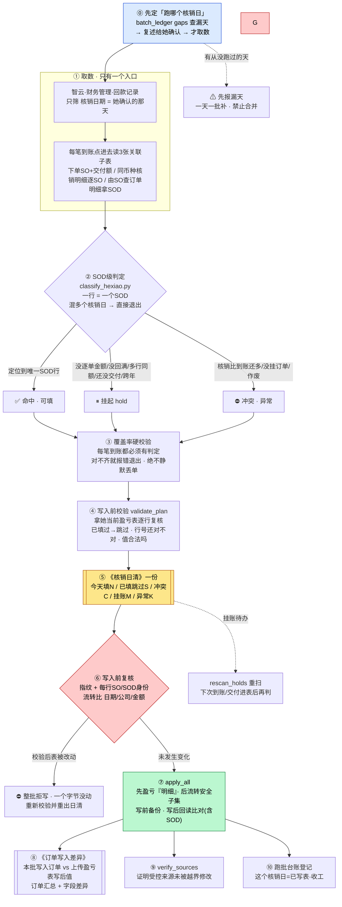
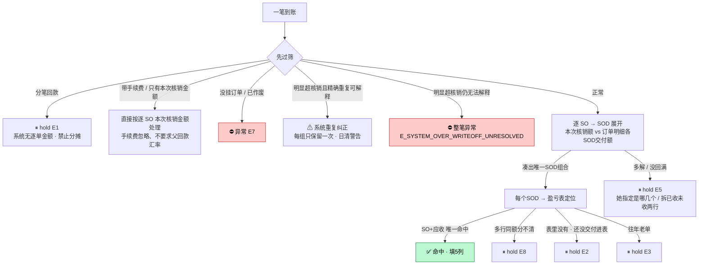

# 应收核销日清（ar-hexiao-daily）

> 出纳每天 T-1 回款核销：**智云取数 → SOD 级判定 → 《核销日清》（盈亏+流转预览）→ 先盈亏明细、后流转安全子集**。
> **永不碰智云**，金额只由 Python 脚本算；日清和写前校验通过后直接写工作副本，无需另行确认。

## 这个技能干嘛

出纳李明妹每天把「昨天到账 → 智云里销售核销 → 回填自己的应收/盈亏大表」这条链路里**最费时的判定 + 回填**自动化。
最耗时的是「一笔到账对应哪几个结算订单号」——要去智云一个个查再手工粘回大表。本技能把这步交给脚本算，
建回款、写智云永远由她手工；技能负责**计算**、**出日清**，并在校验通过后直接**写工作副本**。

技能认得她每天 11 个步骤，**第一版只接第 6/7/8 步**（智云取数 → 判定 → 出清单回填），其余步骤一步不变、逐个再迁。

## 没有它的时候她怎么做（手工流程）

以下是**第 6 步之后**（本技能接管的部分）她原来的做法；第 1–5 步仍是她/销售在做，技能不碰。

| 步 | 她手工怎么做 | 痛在哪 |
|---|---|---|
| 6 | 登录智云，按核销日期筛出昨天销售核销的到账 | 要一笔笔点进去看明细 |
| 7 | 每笔到账点开，看核销到了哪几个订单（SO）、各多少钱 | **最耗时**：一笔到账可能挂好几个订单 |
| 8 | 拿订单号回盈亏大表里筛出对应那行 | 一行 = 一个 SOD；同 SO 多行时要靠金额分辨**哪行是哪个** |
| 9 | 手工填五列：计提 / 回款明细 / 是否结账 / 收款时间 / 收款方式 | **口径绕**：收满才填计提；跨月核销要写「冲预收」；没回满要拆成两行 |
| 10 | 回到到账流转表，写单号、标「是否更新应收款」 | 三键（日期+金额+公司名）人工找行 |
| 11 | 没法当场处理的（还没交付进表、跨年老单）记在脑子里，月初再翻出来补 | **靠人脑记跨天挂账**，最容易漏 |

> 一天十几笔到账、上百个订单行；最容易出错的是**同 SO 多行填错行**、**计提该不该填**、
> 以及**挂账笔忘了回头补**。

## 现在怎么用（人 + AI 怎么配合）

**她只需要做三件事**：把两张表的副本放好 → 说一句话 → 看一眼清单点头。

| 谁 | 做什么 |
|---|---|
| **AI** | 先查漏天，**复述日期**：「我按核销日期 2026-07-24（周五）跑，对吗？」 |
| **她** | 「对」／「跑 7 月 22 号的」 |
| **AI** | 取数（已取过会自动跳过）→ SOD 级判定 → 覆盖率校验 → 写入前校验 → 出**一份《核销日清》** → **★ 停** |
| **她** | 查看日清和写后差异：今天写入 N 行 / 冲突安全跳过 C 行 / 流转自动写 M 笔 |
| **AI** | **写前再复核一次**（表被动过就整批拒写）→ 写盈亏「明细」→ 生成《订单写入差异》→ 写流转安全子集 → 登记跑批台账 |
| **她** | 拿表；挂账的处理完了说「**重扫挂账**」 |

**积了好几天**：说「**把没跑的都跑了**」→ AI **从早到晚一天一天跑几遍**（不并批，见 SKILL §0.45）。

**AI 不许做的**：⛔ 永不写智云；⛔ 跳过日清或写前校验；⛔ 不替她输智云密码；
⛔ 不把客户名/金额明细刷进对话；⛔ 复核没过时加参数硬写。

取数器当前版本为 `2026-07-31-writeoff-record-identity-v1`。核销明细会保留“核销记录NUM”：
同一记录号跨快照只算一次，不同记录号先全部保留。只有父回款明显超核销时，才检查同一父 AR
里的精确重复；能完全解释超额则每组只按一次并在日清警告，不能完全解释则整笔挂账人工检查。

---

## 一图看懂 · 主链路


```mermaid
flowchart TD
    D0["⓪ 先定「跑哪个核销日」<br/>batch_ledger gaps 查漏天<br/>→ 复述给她确认 → 才取数"] --> A
    D0 -.->|"有从没跑过的天"| GAP["⚠ 先报漏天<br/>一天一批补 · 禁止合并"]
    subgraph 取数["① 取数 · 只有一个入口"]
        A["智云·财务管理·回款记录<br/>只筛 核销日期 = 她确认的那天"] --> B["每笔到账点进去读3张关联子表<br/>下单SO+交付额 / 同币种核销明细逐SO / 由SO查订单明细拿SOD"]
    end
    B --> C{"② SOD级判定<br/>classify_hexiao.py<br/>一行 = 一个SOD<br/>混多个核销日 → 直接退出"}
    C -->|"定位到唯一SOD行"| HIT["✅ 命中 · 可填"]
    C -->|"没逐单金额/没回满/多行同额/还没交付/跨年"| HOLD["⏸ 挂起 hold"]
    C -->|"核销比到账还多/没挂订单/作废"| EXC["⛔ 冲突 · 异常"]
    HIT --> COV
    HOLD --> COV
    EXC --> COV
    COV["③ 覆盖率硬校验<br/>每笔到账都必须有判定<br/>对不齐就报错退出 · 绝不静默丢单"] --> V["④ 写入前校验 validate_plan<br/>拿她当前盈亏表逐行复核<br/>已填过→跳过 · 行号还对不对 · 值合法吗"]
    V --> W[["⑤ 《核销日清》一份<br/>今天填N / 已填跳过S / 冲突C / 挂账M / 异常K"]]
    W --> PRE{"⑥ 写入前复核<br/>指纹 + 每行SO/SOD身份<br/>流转比 日期/公司/金额"}
    PRE -->|"校验后表被改动"| REDO["⛔ 整批拒写 · 一个字节没动<br/>重新校验并重出日清"]
    PRE -->|"未发生变化"| AP["⑦ apply_all<br/>先盈亏『明细』· 后流转安全子集<br/>写前备份 · 写后回读比对(含SOD)"]
    AP --> DIFF[["⑧ 《订单写入差异》<br/>本批写入订单 vs 上传盈亏表写后值<br/>订单汇总 + 字段差异"]]
    AP --> VS["⑨ verify_sources<br/>证明受控来源未被越界修改"]
    AP --> BL["⑩ 跑批台账登记<br/>这个核销日=已写表·收工"]
    W -.->|"挂账待办"| R["rescan_holds 重扫<br/>下次到账/交付进表后再判"]

    style D0 fill:#dbeafe,stroke:#1d4ed8,color:#000
    style W fill:#fde68a,stroke:#b45309,color:#000
    style G fill:#fecaca,stroke:#b91c1c,color:#000
    style PRE fill:#fecaca,stroke:#b91c1c,color:#000
    style AP fill:#bbf7d0,stroke:#15803d,color:#000
```

### 两个日期别混（2026-07-25 立）

| 日期 | 是什么 | 驱动 |
|---|---|---|
| **到账日期** | 钱哪天到银行 | 第 1–4 步（日记账 / 挑收入 / 流转表 / 建回款） |
| **核销日期** | 销售哪天在智云把钱核到订单上 | **第 6 步起（本技能默认口径）** |

她的口径原话：「与建回款无固定隔天关系；核了就进那个核销日」→ 两者**天然不是同一天**。
所以每次开跑先 `batch_ledger gaps` 查漏天、再把日期复述给她确认；**一批只跑一天**，
产出一律按**核销日**命名（补跑历史日才不会跟今天那批撞名）。

**她不天天来**（约一周两天，看她哪天有空），一来常积好几天 → **agent 多跑几遍、从早到晚一天一天来**，
不并批。顺序不能反：同一订单可能分两天核销、填**同一行**，先早后晚才接得上（见 `SKILL.md §0.45`）。

## 判定怎么分类 · 每笔到账 → SOD


```mermaid
flowchart TD
    P["一笔到账"] --> Q{"先过筛"}
    Q -->|"分笔回款"| E1["⏸ hold E1<br/>系统无逐单金额 · 禁止分摊"]
    Q -->|"带手续费 / 只有本次核销金额"| EF["直接按逐 SO 本次核销金额处理<br/>手续费忽略、不要求父回款汇率"]
    Q -->|"没挂订单 / 已作废"| E7["⛔ 异常 E7"]
    Q -->|"明显超核销且精确重复可解释"| DUP["⚠ 系统重复纠正<br/>每组只保留一次 · 日清警告"]
    Q -->|"明显超核销仍无法解释"| E4["⛔ 整笔异常<br/>E_SYSTEM_OVER_WRITEOFF_UNRESOLVED"]
    Q -->|"正常"| SO["逐 SO → SOD 展开<br/>本次核销额 vs 订单明细各SOD交付额"]
    SO -->|"凑出唯一SOD组合"| LOC["每个SOD → 盈亏表定位"]
    SO -->|"多解 / 没回满"| E5["⏸ hold E5<br/>她指定是哪几个 / 拆已收未收两行"]
    LOC -->|"SO+应收 唯一命中"| HIT["✅ 命中 · 填5列"]
    LOC -->|"多行同额分不清"| E8["⏸ hold E8"]
    LOC -->|"表里没有 · 还没交付进表"| E2["⏸ hold E2"]
    LOC -->|"往年老单"| E3["⏸ hold E3"]

    style HIT fill:#bbf7d0,stroke:#15803d,color:#000
    style E4 fill:#fecaca,stroke:#b91c1c,color:#000
    style E7 fill:#fecaca,stroke:#b91c1c,color:#000
```

> E 码全表（每个都配「大白话」给明妹看）在 `config/判定码.json`；完整决策树见 `references/规则_判定决策树.md`。

---

## 三条铁边界（任何 AI 不得违反）

1. **永不写智云**——建回款永远她手填，技能只出「今日该建清单」+ 漏建提醒。
2. **分笔回款只能挂起**——系统里没有逐单金额，**禁止按比例分摊**（2026-07-22 静默丢单的教训）。
3. **流转表只出建议、不自动写**；写盈亏表也只碰「明细」sheet，写前备份、写后回读。

## 输入 / 输出

| 输入（智云单入口） | 处理 | 输出 |
|---|---|---|
| 回款记录（筛核销日=T-1）+ 3 张关联子表（下单 / 含核销记录NUM的同币种核销明细 / 订单明细） | 物理记录去重 → 父 AR 条件纠重 → SOD 级判定 → 覆盖率校验 → 写入前校验 | **《核销日清》**：今天填 / 已填跳过 / 冲突 / 挂账 / 异常，并显示系统重复纠正审计 |
| 日清和写前校验通过后 | apply 写盈亏「明细」副本，并对本批实际写入订单逐字段回读 | 写好的副本 + `订单写入差异_<核销日>.xlsx` |

## 触发词（同事说这些话会自动用它）

跑昨天的核销 / 做核销 / 应收核销 / 回款核销 / 核销清单 / 日清 / 挂账还有哪些没做 / 重扫挂账 / 拉智云 / 抓核销 / 确认回填 / 可以写了 / 按这个写 / 跑X月X号的核销 / 补上周的核销 / 哪几天没跑 / 有没有漏的天 / 把没跑的都跑了 / 这几天的一起做

## 会变的在哪（改表不改码）

| 文件 | 改什么 |
|---|---|
| `config/业务规则.md` | 手续费口径、尾差阈值、跨年老单、**日期口径与写前复核** |
| `工作区/03_台账/跑批台账.json` | 哪个核销日跑过/漏了（程序自动写，也可人工订正） |
| `config/判定码.json` | E 码文案 / 大白话 |
| `config/列名别名.json` | 她盈亏表列名变了加别名 |

## 怎么跑（命令链，顺序钉死）

```bash
batch_ledger gaps                  # ★ 先查漏天 → 复述核销日给她确认
fetch_zhiyun --date <核销日> → verify_sources snapshot → inspect_inputs
→ classify_hexiao --hexiao-date <核销日>
→ validate_plan → build_flow_plan → build_worklist
→ apply_all --in-place --flow-in-place → verify_sources verify
```

> ⚠ `validate_plan` **必须在** `build_worklist` **之前**——否则她昨天已填过的会被又列一遍。完整命令见 `SKILL.md §3.1`。
>
> 写入成功后自动生成《订单写入差异》。它只比较本批实际写入订单及部分回款拆出的新增行，
> 不把上传盈亏表中的全部历史订单列成“多余订单”。

## 验收口径（判断脚本对不对）

- pytest **≥186 例全绿**；无 `--confirmed` 时 apply 可正常执行，旧参数仍兼容。
- 每条原始核销记录都有明确处置；系统重复忽略同时影响本次 `H` 与累计 `R`；审计指纹被修改时 `validate_plan` 必须拒绝。
- **校验后工作副本被动过** → apply 必须非 0 退出且源表哈希**仍然不变**（一个字节没写）。
- 写入成功后必须生成《订单写入差异》，并同时提供订单级结果和字段级差异；
  正常成功写入时字段差异数应为 0。
- **漏天查得出**：跑过 7-20 与 7-23 后，`batch_ledger gaps` 必须报出 7-21 / 7-22。
- **金标（2026-07-22 真实 13 笔）**：157 个 SOD 行、可填 143、与她手工填的**逐格一致 143/143**、异常 0、13 笔到账全覆盖。改完代码这条必须仍成立。

## 数据红线

应收/回款/核销数据涉财务口径与客户名，**只在本地跑、对话不回显客户名与金额明细、真实数据不进仓库**。
