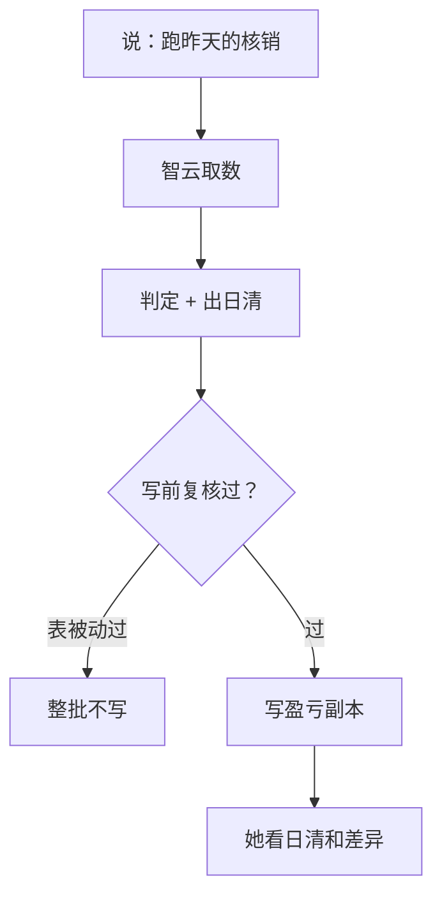

# 应收核销日清（ar-hexiao-daily）

> 出纳每天 T-1 回款核销：**智云取数 → SOD 级判定 → 《核销日清》（盈亏+流转预览）→ 先盈亏明细、后流转安全子集**。
> **永不碰智云**，金额只由 Python 脚本算；日清和写前校验通过后直接写工作副本，无需另行确认。

## 这个技能干嘛

出纳李明妹每天把「昨天到账 → 智云里销售核销 → 回填自己的应收/盈亏大表」这条链路里**最费时的判定 + 回填**自动化。
最耗时的是「一笔到账对应哪几个结算订单号」——要去智云一个个查再手工粘回大表。本技能把这步交给脚本算，
建回款、写智云永远由她手工；技能负责**计算**、**出日清**，并在校验通过后直接**写工作副本**。

技能认得她每天 11 个步骤，**第一版只接第 6/7/8 步**（智云取数 → 判定 → 出清单回填），其余步骤一步不变、逐个再迁。

## 没有它的时候她怎么做（手工流程）

以下是**第 6 步之后**（本技能接管的部分）她原来的做法；第 1–5 步仍是她/销售在做，技能不碰。

| 步 | 她手工怎么做 | 痛在哪 |
|---|---|---|
| 6 | 登录智云，按核销日期筛出昨天销售核销的到账 | 要一笔笔点进去看明细 |
| 7 | 每笔到账点开，看核销到了哪几个订单（SO）、各多少钱 | **最耗时**：一笔到账可能挂好几个订单 |
| 8 | 拿订单号回盈亏大表里筛出对应那行 | 一行 = 一个 SOD；同 SO 多行时要靠金额分辨**哪行是哪个** |
| 9 | 手工填五列：计提 / 回款明细 / 是否结账 / 收款时间 / 收款方式 | **口径绕**：收满才填计提；跨月核销要写「冲预收」；没回满要拆成两行 |
| 10 | 回到到账流转表，写单号、标「是否更新应收款」 | 三键（日期+金额+公司名）人工找行 |
| 11 | 没法当场处理的（还没交付进表、对应年度表缺失或缺单）记在脑子里，月初再翻出来补 | **靠人脑记跨天挂账**，最容易漏 |

> 一天十几笔到账、上百个订单行；最容易出错的是**同 SO 多行填错行**、**计提该不该填**、
> 以及**挂账笔忘了回头补**。

## 现在怎么用（人 + AI 怎么配合）

**她只需要做两件事**：把两张表的副本放好 → 说一句核销指令。程序会自动取数、判定、校验、写表并报告结果。

| 谁 | 做什么 |
|---|---|
| **AI** | 解析核销日期并查漏天；漏跑日期从早到晚逐日处理，不等待确认 |
| **AI** | 自动抓取智云 → SOD 级判定 → 覆盖率校验 → 写入前校验 → 出**一份《核销日清》** → 直接写表 |
| **AI** | **写前再复核一次**（表被动过就整批拒写）→ 写盈亏「明细」→ 生成《订单写入差异》→ 写流转安全子集 → 登记跑批台账 |
| **用户** | 任务结束后查看日清、差异和挂账结果；挂账条件消除后再发「**重扫挂账**」 |

**积了好几天**：说「**把没跑的都跑了**」→ AI 一次登录取完各日独立数据，再**从早到晚逐日判定和写表**（见 SKILL §0.45）。

**AI 不许做的**：⛔ 永不写智云；⛔ 跳过日清或写前校验；⛔ 把凭据写进代码、命令行或文件；
⛔ 不把客户名/金额明细刷进对话；⛔ 复核没过时加参数硬写。

取数器当前版本为 `2026-08-21-atomic-fetch-v5`。每个核销日先在暂存目录生成完整四件套，再发布文件并最后发布带四件套 SHA-256 的摘要；瞬时 502、其它 5xx 和网络超时会有限重试，订单明细查询失败会终止该日取数。订单交付会读取智云订单详情的“项目交付日期”，缺失时按 SO 精确回读订单详情，仍缺失或冲突就挂账，不按单号推测。下单关联为空时会回查同一父回款的结算关联；核销明细会保留“核销记录NUM”：
同一记录号跨快照只算一次，不同记录号先全部保留。只有父回款明显超核销时，才检查同一父 AR
里的精确重复；能完全解释超额则每组只按一次并在日清警告，不能完全解释则整笔挂账人工检查。

---

## 一图看懂


```mermaid
flowchart TD
  A["说：跑昨天的核销"] --> B["智云取数"]
  B --> C["判定 + 出日清"]
  C --> D{"写前复核过？"}
  D -->|表被动过| E["整批不写"]
  D -->|过| F["写盈亏副本"]
  F --> G["她看日清和差异"]
```

判定细则见 `references/规则_判定决策树.md`，不画进这张图。

### 两个日期别混（2026-07-25 立）

| 日期 | 是什么 | 驱动 |
|---|---|---|
| **到账日期** | 钱哪天到银行 | 第 1–4 步（日记账 / 挑收入 / 流转表 / 建回款） |
| **核销日期** | 销售哪天在智云把钱核到订单上 | **第 6 步起（本技能默认口径）** |

她的口径原话：「与建回款无固定隔天关系；核了就进那个核销日」→ 两者**天然不是同一天**。
所以每次开跑先 `batch_ledger gaps` 查漏天、在任务内部固定日期；取数可一次登录按多个固定日期逐日查询，**判定和写表一批只跑一天**，
产出一律按**核销日**命名（补跑历史日才不会跟今天那批撞名）。

**她不天天来**（约一周两天，看她哪天有空），一来常积好几天 → 先一次登录取完各日独立数据，再由 agent **从早到晚逐日判定和写表**。
顺序不能反：同一订单可能分两天核销、填**同一行**，先早后晚才接得上（见 `SKILL.md §0.45`）。

判定分类、E 码大白话在 `config/判定码.json`；完整决策树见 `references/规则_判定决策树.md`。

---

## 三条铁边界（任何 AI 不得违反）

1. **永不写智云**——建回款永远她手填，技能只出「今日该建清单」+ 漏建提醒。
2. **缺逐单金额只能顺序核销**——按交付额从小到大依次承接父回款，禁止均分或按比例分摊；缺交付额或金额口径不可比才挂起。
3. **流转表只改安全子集**（单号、是否更新应收款，且必须强三键唯一命中）；写盈亏表也只碰「明细」sheet，写前备份、写后回读。

## 输入 / 输出

| 输入（智云单入口） | 处理 | 输出 |
|---|---|---|
| 回款记录（筛核销日=T-1）+ 3 张关联子表（下单 / 含核销记录NUM的核销明细 / 订单明细） | 按记录NUM做跨快照物理去重 → 逐 SO 金额优先 → SOD 级判定与多父回款逐笔拆行 → 覆盖率校验 → 写入前校验 | **《核销日清》**：今天填 / 已填跳过 / 冲突 / 挂账 / 异常，并显示逐笔分拆警告与来源审计 |
| 日清和写前校验通过后 | apply 写盈亏「明细」副本，并对本批实际写入订单逐字段回读 | 写好的副本 + `订单写入差异_<核销日>.xlsx` |

## 触发词（同事说这些话会自动用它）

跑昨天的核销 / 做核销 / 应收核销 / 回款核销 / 核销清单 / 日清 / 挂账还有哪些没做 / 重扫挂账 / 拉智云 / 抓核销 / 确认回填 / 可以写了 / 按这个写 / 跑X月X号的核销 / 补上周的核销 / 哪几天没跑 / 有没有漏的天 / 把没跑的都跑了 / 这几天的一起做

## 会变的在哪（改表不改码）

| 文件 | 改什么 |
|---|---|
| `config/业务规则.md` | 手续费口径、尾差阈值、年度盈亏表路由、**日期口径与写前复核** |
| `工作区/03_台账/跑批台账.json` | 哪个核销日跑过/漏了（程序自动写，也可人工订正） |
| `config/判定码.json` | E 码文案 / 大白话 |
| `config/列名别名.json` | 她盈亏表列名变了加别名 |

## 怎么跑（命令链，顺序钉死）

```bash
batch_ledger gaps                  # ★ 内部查漏天 → 固定日期范围
fetch_zhiyun --date-from <开始日> --date-to <结束日> --force  # 多日只登录一次；每天独立四件套
verify_sources snapshot → inspect_inputs
→ classify_hexiao --hexiao-date <核销日>
→ validate_plan → build_flow_plan → build_worklist
→ apply_all --in-place --flow-in-place → verify_sources verify
```

> ⚠ `validate_plan` **必须在** `build_worklist` **之前**——否则她昨天已填过的会被又列一遍。完整命令见 `SKILL.md §3.1`。
>
> 写入成功后自动生成《订单写入差异》。它只比较本批实际写入订单及部分回款拆出的新增行，
> 不把上传盈亏表中的全部历史订单列成“多余订单”；收款时间、收款方式不参与差异判定，
> 但仍按业务规则写入并接受写后回读校验。

## 验收口径（判断脚本对不对）

- pytest **≥431 例全绿**；无 `--confirmed` 时 apply 可正常执行，旧参数仍兼容。
  私有 CI 设置 `AR_HEXIAO_TEST_DATA=<脱敏真实结构测试集>` 和
  `AR_HEXIAO_REQUIRE_REAL_FIXTURES=1` 后，缺少金标盈亏表、银行日记账或到账流转表会直接失败，
  不再以 skipped 状态通过。
- 每条原始核销记录都有明确处置；系统重复忽略同时影响本次 `H` 与累计 `R`；审计指纹被修改时 `validate_plan` 必须拒绝。
- **校验后工作副本被动过** → apply 必须非 0 退出且源表哈希**仍然不变**（一个字节没写）。
- 写入成功后必须生成《订单写入差异》，并同时提供订单级结果和字段级差异；
  正常成功写入时字段差异数应为 0。
- **漏天查得出**：跑过 7-20 与 7-23 后，`batch_ledger gaps` 必须报出 7-21 / 7-22。
- **金标（2026-07-22 真实 13 笔）**：157 个 SOD 行、可填 143、与她手工填的**逐格一致 143/143**、异常 0、13 笔到账全覆盖。改完代码这条必须仍成立。

## 数据红线

应收/回款/核销数据涉财务口径与客户名，**只在本地跑、对话不回显客户名与金额明细、真实数据不进仓库**。
