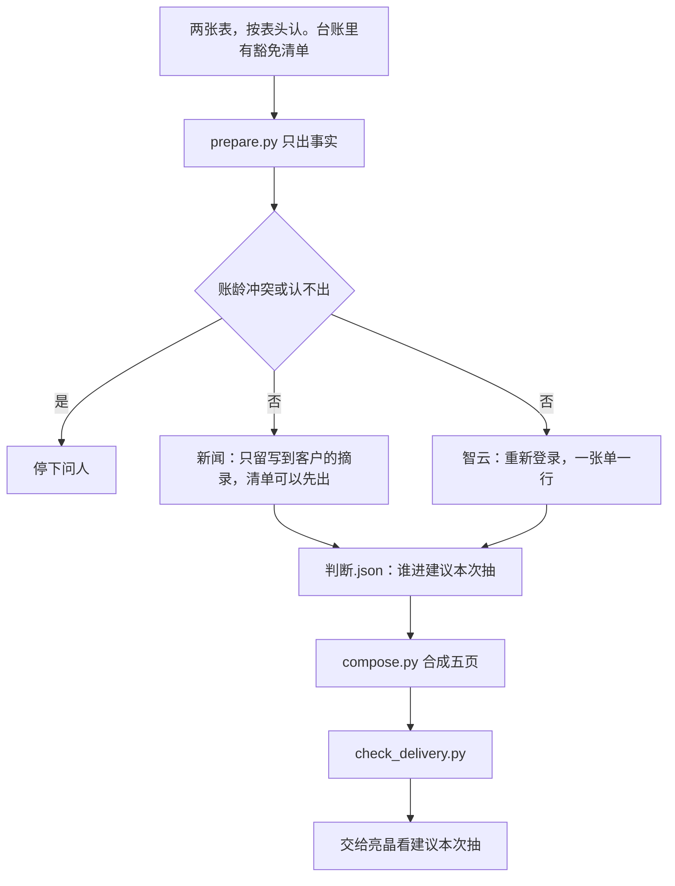

# 应收抽查

亮晶每周抽一批还挂着的应收，向销售要盖章或对公邮件。她给两张 Excel。Agent 认表头、跑脚本、写成一个五页工作簿。建议本次抽是这一期要看的结果，她点头前不交给陆总。

图：[流程图.png](流程图.png)

五页：待抽查清单、建议本次抽、豁免与已回款、风险提示、智云核对。谁进建议本次抽由模型按 `references/判断.md` 写成 `判断.json`，脚本只写回，不替人挑。

判断在 `references/判断.md`，新闻在 `references/新闻.md`，合同在 `references/合同.md`。月份拆法在 `scripts/months.py`，不要另写一套。

开口说「这周抽查」。已下线的 `compliance-spot-check` 不要再跑。

新闻先跑 `scripts/news_plan.py`，再跑 `scripts/news_fetch.py`。脚本只用客户名搜索，摘录里没有这家客户的写成未查到。不要开子代理，也不要把必搜名单拆组。她要先看清单时，`compose.py` 加 `--news-pending`，`check_delivery.py` 加 `--list-only`，看到 `status=list_ready` 再给。最终交卷这两个参数都不要加。

真表、口令、客户明细不进这个仓库。同事从 Gitee `main` 更新。
