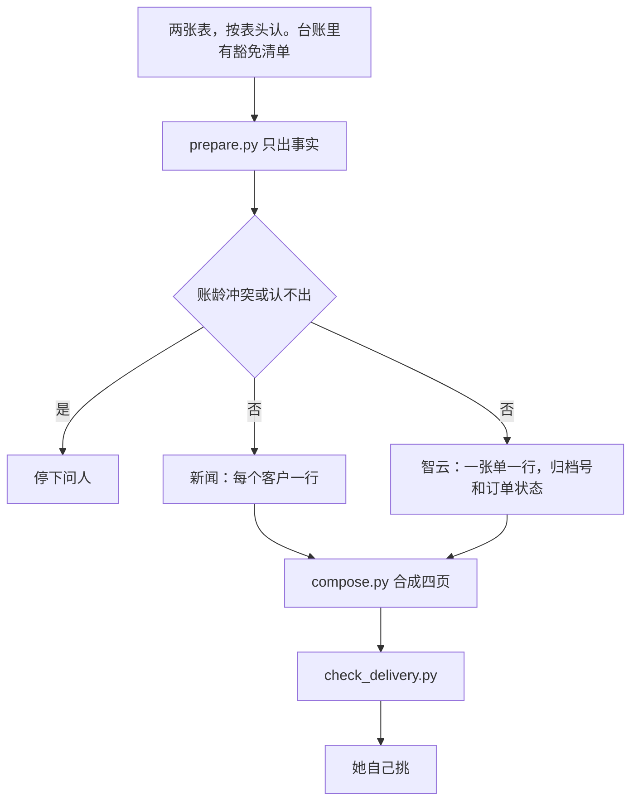

# 应收抽查

亮晶每周抽一批还挂着的应收，向销售要盖章或对公邮件。Agent 认两张表、调用月份脚本、写成四页：待抽、豁免、风险提示、智云核对。她自己挑。

图：[流程图.png](流程图.png)

判断在 `references/判断.md`，新闻在 `references/新闻.md`，合同在 `references/合同.md`。月份拆法在 `scripts/months.py`，不要另写一套。

真表、口令、客户明细不进这个仓库。同事从 Gitee `main` 更新。
