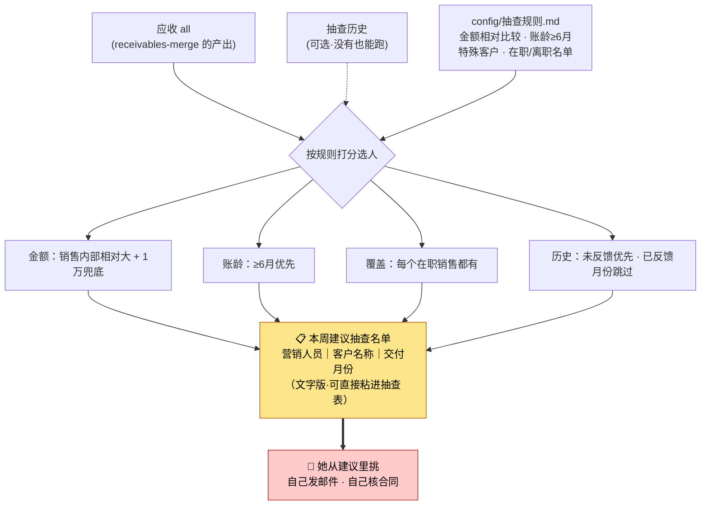

# 合规文件抽查（compliance-spot-check）

> 一句话定位：应收 all（+可选抽查历史）→ 按规则算出**本周该抽谁**的建议名单（营销人员｜客户｜交付月份）
> → **人从建议里挑、自己发邮件、自己核合同**。只推荐，不自动发、不判合同是否匹配。

## 1. 这个技能干嘛

每周财务要从应收订单里挑一批，通知对应销售提供**合规文件**（合同、对账记录），
再人工核查「合同与订单是否匹配」。挑谁本身就很花时间：要兼顾金额大小、账龄长短、
覆盖到每个在职销售、还不能老抽同一个人同一个月。

本技能把**挑名单**这步自动化，产出一份可直接粘进抽查表的文字版清单。
**发邮件和核合同仍然是人做**——这是刻意的边界，不是没做完。

## 2. 没有它的时候她怎么做（手工流程）

| 步 | 她手工怎么做 | 痛在哪 |
|---|---|---|
| 1 | 打开应收 all，按销售分组看 | 几千行，靠眼睛扫 |
| 2 | 每个销售名下挑金额较大、账龄较长的订单 | **金额"大"是相对的**——大客户几十万才算大，小销售一万就算大，全靠脑子换算 |
| 3 | 翻上几周抽查记录，避开刚抽过的月份 | 历史散在几个文件里，容易重复抽 |
| 4 | 检查是不是每个在职销售都覆盖到了 | 漏人了下周才发现 |
| 5 | 手工誊成名单，逐个发邮件 | — |

> 最容易出错的是**重复抽同一销售同一月份**和**漏掉某个销售**。

## 3. 现在怎么用（人 + AI 怎么配合）

**她只需要做三件事**：给一张应收 all → 说一句话 → 从建议名单里挑。

| 谁 | 做什么 |
|---|---|
| **她** | 把应收 all 放好（或直接说在哪），说「**本周抽谁**」 |
| **AI** | 认文件 → 读 `config/抽查规则.md` → 按规则打分选人 → 出**文字版建议清单** |
| **AI** | 有拿不准的**主动问一句**（见下），没有就直接给名单 |
| **她** | 从建议里挑最终名单 → **她自己发邮件、自己核合同** |

**AI 只在这几种情况问她**（其余自己消化）：
1. 某个销售名下一个候选都没有 →「测销戊名下都是短账龄小额，这周先不抽他可以吗？」
2. 冒出陌生的「大客户但账龄短」→ 问要不要加进特殊客户名单（答案写回 config）
3. 她说要优先盯某个销售/客户 → 按她说的调

**选人规则**（都在 `config/抽查规则.md`，改表不改码）：
- 金额：**按销售内部相对比较**（避免大小销售没法比）+ 1 万绝对兜底
- 账龄：≥6 个月优先；特殊客户（如方圆）用相对口径
- 覆盖：尽量覆盖**在职**销售；已离职跳过
- 历史：**未反馈的优先**；已反馈过的月份跳过

**AI 不许做的**：⛔ 不自动发邮件；⛔ 不判定合同与订单是否匹配（那是人的专业判断）；
⛔ 不把客户名和金额明细刷进对话。

## 4. 一图看懂



## 5. 输入 / 输出

| 输入 | 处理 | 输出 |
|---|---|---|
| 应收 all（必需）+ 抽查历史（可选，没有就当无历史跑） | 相对金额 + 账龄 + 覆盖 + 历史去重 | 文字版建议清单（营销人员｜客户名称｜交付月份）+ 运行摘要 |

## 6. 触发词

合规抽查 / 合规文件抽查 / 本周抽谁 / 抽查建议 / 合规文件名单 / 要合同对账抽查名单

## 7. 会变的在哪（改表不改码）

| 文件 | 改什么 |
|---|---|
| `config/抽查规则.md` | 每周抽几条、金额兜底线、账龄门槛、**特殊客户名单**、**离职名单** |
| `config/列名别名.json` | 应收 all 列名变了加别名 |

她口头说「某某离职了」「方圆算特殊客户」→ AI 改这张表 → 重跑，不动代码。

## 8. 怎么跑

```bash
python3 scripts/recommend.py --input <应收all.xlsx> [--history <抽查历史.xlsx>]
python3 tests/test_robustness.py     # 回归
```

## 9. 验收口径

- 合成回归 **47/47 全绿**
- 覆盖检查：在职销售**每人至少 1 条**，或日志明确说明为什么没有
- 历史去重：已反馈过的「销售+客户+月份」组合不再出现

## 10. 数据红线与已知边界

- 应收数据含客户名与金额，**只在本机跑、不进仓库、对话不回显明细**
- **只推荐不执行**：不发邮件、不判合同匹配、不改应收表
- **尚待亮晶用真实 all 完整试用一轮**（目前仅合成数据通过）

> 需求与方案底稿（不进本仓）：`财务部skills/技能/合规文件抽查/方案与文档/`
