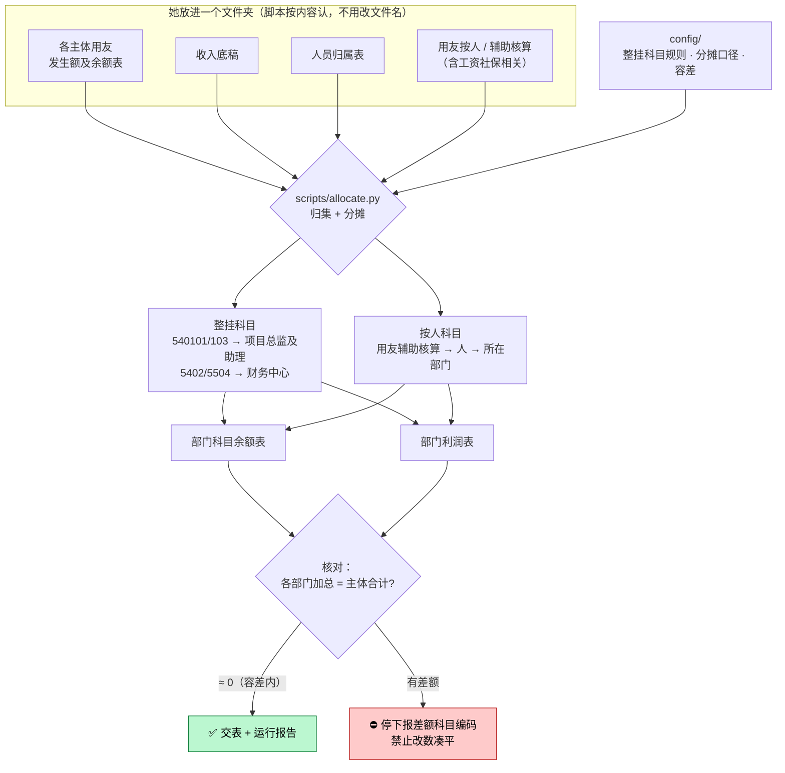

# 部门费用归集分摊（dept-expense-alloc）

> 一句话定位：各主体用友科目余额 + 收入底稿 + 人员归属 + 按人费用 → **部门科目余额表 + 利润表**，
> 所有主体合计 = 所有部门合计（**核对 ≈ 0**）。核对不平**绝不改数凑平**，停下来报科目。

## 1. 这个技能干嘛

总账会计每月要把损益**按部门拆开**，做成「部门科目余额表 + 部门利润表」，
供管理层看各部门赚不赚钱。难点不是加减法，是**每一笔费用该归谁**：
有的科目整块挂给某个部门，有的要按人头拆到人所在的部门，
而"人属于哪个部门"和"用友辅助核算里记的是谁"经常对不上。

本技能把这套归集 + 分摊 + 核对固化成脚本，**金额只由 `scripts/allocate.py` 算**。

## 2. 没有它的时候她怎么做（手工流程）

| 步 | 她手工怎么做 | 痛在哪 |
|---|---|---|
| 1 | 从用友导出各主体「发生额及余额表」 | 多个主体，多个文件 |
| 2 | 对着人员归属表，把按人核算的费用一个个归到部门 | **最耗时**：几百条按人明细，靠 VLOOKUP + 手工修 |
| 3 | 特殊科目整块挂部门（如 540101/103 挂项目总监及助理、5402/5504 挂财务中心） | 口径记在脑子里，换人做就错 |
| 4 | 各部门加总，跟主体合计对平 | **对不平最痛**：几百行里找那几分钱差在哪 |
| 5 | 排版成部门科目余额表 + 利润表 | — |

> 手工一整天起步；最容易出错的是**人员归属对不上**和**核对差额找不到源头**。

## 3. 现在怎么用（人 + AI 怎么配合）

**她只需要做三件事**：把当月材料装进一个文件夹 → 说一句话 → 看核对是否为 0。

| 谁 | 做什么 |
|---|---|
| **她** | 把当月材料放进一个文件夹（主体余额表 / 收入底稿 / 人员归属 / 用友按人），说「**跑本月部门费用归集**」 |
| **AI** | **按内容认文件**（不要求她改文件名）→ 调 `allocate.py` 算 → 出两张表 + 运行报告 |
| **AI** | 核对 ≈ 0 → 一句话交表；**核对不平 → 停下来报差额科目编码，问她** |
| **她** | 看核对结果与两张表；口径要调就说一句，AI 改 config 重跑 |

**AI 不许做的**：
- ⛔ **核对不平禁止改数凑平**——报编码、停下来问，绝不"抹平"
- ⛔ 金额不许心算，只能由脚本算
- ⛔ 不把金额明细、员工姓名打进对话（只说成功/缺什么/差额科目编码）

## 4. 一图看懂



## 5. 输入 / 输出

| 输入（一个文件夹，子夹名近似即可） | 处理 | 输出 |
|---|---|---|
| 主体余额表 / 收入底稿 / 人员归属 / 用友按人 | 整挂 + 按人归集 → 分摊 → 核对 | `部门科目余额表.xlsx`、`利润表`、`运行报告.txt` |

## 6. 触发词

部门费用归集 / 部门科目余额表 / 费用分摊到部门 / 做本月部门分析表 / 损益按部门拆 / 跑斯佳那张表 / 部门归属费用分析

## 7. 会变的在哪（改表不改码）

| 文件 | 改什么 |
|---|---|
| `config/` 归集规则 | 哪些科目整挂哪个部门、按人科目清单、**核对容差** |
| `config/列名别名.json` | 用友导出列名变了加别名 |

## 8. 怎么跑

```bash
python3 scripts/allocate.py --input-dir <当月材料文件夹> --out <部门科目余额表.xlsx>
python3 tests/test_robustness.py     # 回归
```

依赖：`pip install openpyxl xlrd pandas`（跑不起来就说「配下环境」，交给 `env-doctor`）

## 9. 验收口径

- 回归全绿
- **核对 ≈ 0**（容差见 config）——这是本技能的主验收线
- 整挂科目口径逐条与她确认过：540101/103 → 项目总监及助理；5402/5504 → 财务中心；按人主源 = 用友辅助核算

## 10. 数据红线与已知边界

- 用友数据含员工姓名与薪酬相关金额，**只在本机跑、不进仓库、对话不回显**
- **不改数凑平**；核对不平即停
- **尚待斯佳姐用真实月份完整试用一轮**

> 需求与给同事的《使用说明》（不进本仓）：`财务部skills/技能/部门费用归集分摊/`
