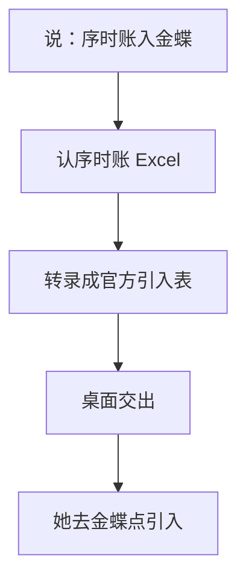

# 序时账入金蝶（kingdee-gl-import）

> 一句话定位：她发的 Excel 序时账 → 金蝶官方凭证引入表；人过目后自己去星辰点引入。湖南分抄作业走这里。

## 启动时说

- **推荐**：序时账入金蝶
- 也可：抄作业入金蝶 / 湖南分入账 / 把序时账做成引入表 / 凭证导入模板 / 凭证列表入金蝶

## 1. 这个技能干嘛

斯佳每月把湖南分公司的序时账 Excel 发给同事，要抄进 **金蝶云星辰 · 湖南分公司**。源表不是官方引入模板。本技能按行转录，附件列强制留空，凭证号可按她说的起始号重排。

## 2. 一图看懂



## 3. 输入 / 输出

| 输入 | 处理 | 输出 |
|---|---|---|
| 序时账 xlsx；可选「从 N 号开始」 | 转录进技能自带空模 | `凭证引入_结果.xlsx` + `运行报告.txt`（默认桌面） |

## 4. 会变的在哪

| 文件 | 改什么 |
|------|--------|
| `config/列名别名.json` | 表头 |
| `config/凭证引入空模.xlsx` | 官方空模 |
| `config/业务规则.md` | 口径 |

## 5. 怎么跑

```bash
python3 scripts/convert.py --input 源.xlsx
python3 scripts/convert.py --input 源.xlsx --start-voucher-no 11
```

## 6. 验收

- `pytest skills/kingdee-gl-import/tests` 全绿
- 附件列全空；记-7 这类借方红字仍在借方
- 说了起始号则从该号连排
- 本机 opencode「序时账入金蝶」命中本技能，不误入 `kingdee-posting`

## 7. 数据红线

- 真序时账不进 git
- 不点引入 / 审核 / 过账
- 对话不报分录金额
