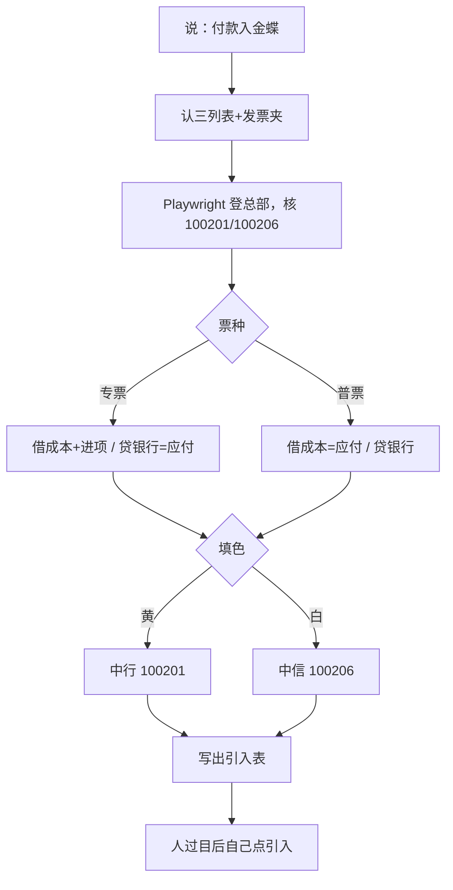

# 供应商付款入金蝶（斯佳）

> 一句话定位：付款三列表 + 各家发票 PDF → 金蝶凭证引入表。人过目后自己去金蝶点引入。

## 启动时说

- **推荐**：付款入金蝶
- 也可：供应商付款入金蝶 / 应付记账

不要说「金蝶入账」——那句会进销项/收款技能。

## 1. 这个技能干嘛

斯佳每月把别人做好的付款台账和每家发票夹，按专票/普票填进金蝶。技能读三列表、读 PDF、看填色走哪家银行、对供应商档案，写出官方引入表。

## 2. 没有它的时候她怎么做

| 步 | 手工 | 痛在哪 |
|---|---|---|
| 1 | 复制三列，打开每家发票 | 一家多张要对合计 |
| 2 | 专票拆进项、普票全额进成本 | 电子票税额不好抄 |
| 3 | 黄走中行、没色走中信 | 听明妹，手标 |
| 4 | 无档小额挂 9999，大额问要不要建 | 容易漏问 |

## 3. 现在怎么用

她只做三件事：把表和发票夹放一起 → 说「付款入金蝶」 → 看对照说明，点头或回答是/否。

脚本会停下来问的：

- 档案没有：标黄（中行）和没标黄（中信）**一次问清**。中行新建 `--create-new-suppliers`；中信挂 9999 `--citic-as-other`；中信也新建 `--create-new-suppliers-citic`
- 本批有发票合计大于应付 → 是否一律按应付记（`--book-short-pay`，一批一次）

## 输入 / 输出

- 入：三列表 + 一家一个夹（只读 PDF）
- 出：桌面 `金蝶入账_付款_YYYYMMDD/`

## 会变的在哪

`config/rules.json` 成本/进项/银行/0405。本机密钥不进仓。
