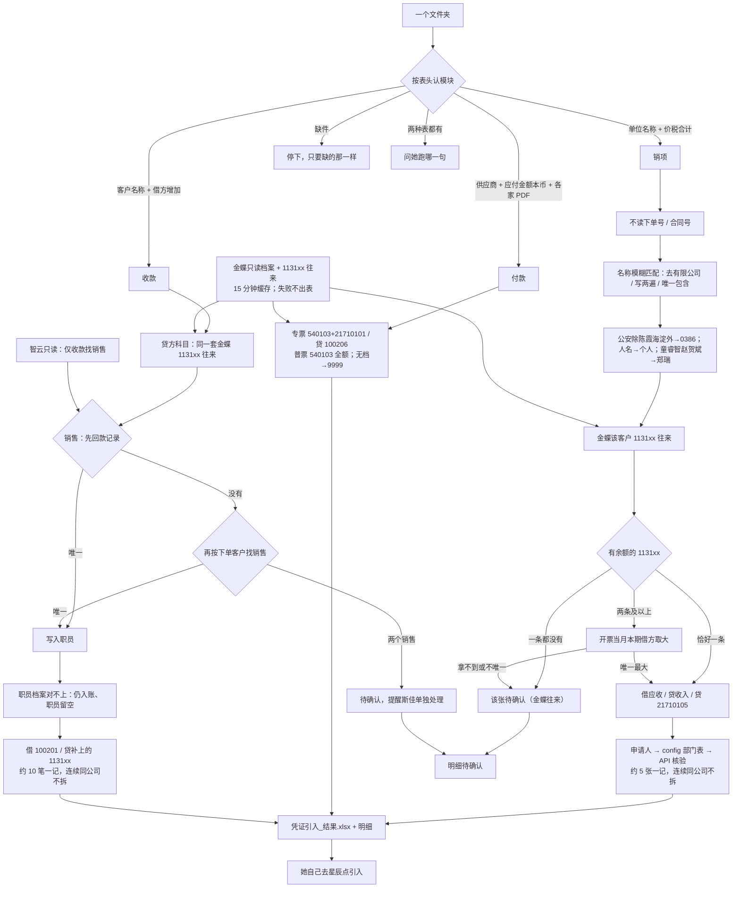

# 金蝶入账（kingdee-posting）

> 一句话定位：放好一个文件夹，说「销项发票入金蝶 / 付款入金蝶 / 收款入金蝶」→ 技能填官方「凭证引入」表。**人过目后自己去金蝶点引入**；技能不点引入、审核、过账。

## 启动时说

对 opencode 说下面任一句（文件放好，路径一起说）：

- **推荐**：销项发票入金蝶 / 付款入金蝶 / 收款入金蝶
- 也可：琪哥发票入金蝶（仍进销项） / 发票入金蝶 / 供应商付款入金蝶 / 收款入账
- 不是这个：更新财务skills（那是拉代码，不记账）

> 三个模块**分开说**。夹里不止一种表时，技能会问你要跑哪一句。

## 1. 这个技能干嘛

月底把销项发票、供应商付款、银行收款做成金蝶能导入的凭证。以前靠人看表、去档案里对编码、手填引入模板。本技能按表头认是哪一块，缺材料只要缺的那一样；齐了由脚本补科目/销售、算分录，交出引入表。

**科目（斯佳/明昊 2026-08-31）**：发票不看「下单号」「合同号」，**不用智云业务线**。对上客户后看金蝶该客户 1131xx 往来：一条有余额就用，多条看开票当月本期借方取大，余额被回款冲平则用当月本期借方，没有往来则待确认。收入 5101+后两位。收款销售先对智云**回款记录**，没有再对**下单**。档案没有先问斯佳是否新建。

## 2. 没有它的时候她怎么做（手工流程）

| 步 | 她手工怎么做 | 痛在哪 |
|---|---|---|
| 1 | 打开发票簿 / 付款台账+PDF / 收款表 | 列多、专普要一张张认 |
| 2 | 去金蝶查客户、供应商、职员、部门编码 | 抬头和档案名经常不完全一样 |
| 3 | 按约 5 张（销项）或 10 笔（收款）打成一记；连续同公司不拆 | 硬切会把同一家拆到两记 |
| 4 | 填官方引入模板，再自己去星辰点引入 | 辅助维少填/多填整张失败 |

> 手工大约半天到一天；技能只填表，**引入仍是她点**。

## 3. 现在怎么用（人 + AI 怎么配合）

**她只需要做三件事**：放文件夹 → 说一句话 → 看一眼产出，自己去金蝶引入。

| 谁 | 做什么 |
|---|---|
| **她** | 把当批材料放进一个文件夹，说上面那句 |
| **AI** | 认表 → 调 `scripts/convert.py` → 同一文件夹交出 `凭证引入_结果.xlsx` → **停下** |
| **她** | 看待确认；能转的自己去金蝶「凭证引入」 |
| **AI** | 不点引入、审核、过账 |

**她会看到的话长这样**：

```
这批 30：可入账 28，待确认 2。填好的金蝶表在 <路径>。请您看待确认，再自己去金蝶引入。我没有点引入。
```

**AI 不许做的**：猜公安映射；编客户/供应商编码；把客户名/金额打进对话；要她改文件名；要金蝶登录密码。

## 4. 一图看懂



历史方案总图（8/26，黄条「空账」已过期，总部已改绑）：


### 4.1 三模块现在怎么算

**销项发票**

1. 认表：sheet 叫「发票」或表头同时有单位名称、价税合计。不靠文件名。
2. **不读**「下单号」「合同号」。表里就算填了科目也不用。
3. 客户名称先模糊对金蝶档案（去「有限公司」、档案名写两遍、唯一包含）。公安除陈霞+海淀外归 0386；人名走「个人」。对不上 → 问斯佳是否新建，不调保存 API。
4. 对上客户后查金蝶该客户 `1131xx`：**有余额仅一条**就用它。多条则开票当月**本期借方**取大。余额为 0 但当月有借方 → 用借方科目。没有往来或借方并列 → 待确认。收入 = `5101` + 应收后两位。**不用智云业务线。**
5. （已并入上条）不许用智云下单额代替往来。
6. 部门：申请人查 `申请人部门.json`。职员：`职员挂靠.json`（童睿智/赵贺斌→郑瑞）后再核验档案。人不在表、档案没有或不唯一 → 待确认。
7. 分录：借应收（价税合计）/ 贷收入（金额）/ 贷 21710105（税额，不挂辅助）。约 5 张一记，连续同一家不拆。记账日当天。

**付款**（预处理没改分录）

- 专票：借 540103 + 21710101 / 贷 100206。普票：借 540103 全额 / 贷 100206。
- 认不清专普、票合计小于应付 → 待确认。无档或一对多 → 9999。8/19 记-75 不要再导。

**收款**

1. 至少要日期、客户名称、借方（增加）、部门编码。表内「销售」「应收账款编码」有也不用。
2. 贷方科目：同销项，金蝶该客户 1131xx 往来（收款日所在月）。
3. 销售：①智云回款记录（客户+到账日+金额）唯一命中；②回款没有（明妹还没登）→ 下单页该客户的销售；③下单对上两个销售 → 待确认，话术提醒斯佳单独处理。
4. 销售名字对不上金蝶职员：这笔仍入账，职员辅助核算留空。职员档案一对多才 hold。
5. 分录：借 100201（不挂辅助）/ 贷补上的 1131xx（客户+部门+职员）。约 10 笔一记，连续同一家不拆。公安规则同销项。

**两套只读闸门**

- 金蝶：`kingdee.local.json` → 当前客户/供应商/部门/职员 + 1131xx 往来。失败或过期缓存不得出表。
- 智云：仅**收款**找销售。`zhiyun.local.json` → Playwright 登录。销项不登智云。

## 5. 输入 / 输出

| 模块 | 她给什么 | 技能补什么 | 输出 |
|------|----------|------------|------|
| 销项发票 | 发票簿：单位名称、价税合计、申请人（可无发票号、组织架构 sheet、科目列、下单号） | 金蝶 1131xx 往来→应收/收入；申请人→部门 | `凭证引入_结果.xlsx` + 明细 |
| 付款 | 三列表（供应商 / 应付金额本币 / 开户名）+ 一家一个夹，夹里 PDF | 科目固定；无档→9999 | 同上 |
| 收款 | 日期 / 客户名称 / 借方（增加）/ 部门编码（表内销售、应收账款编码可缺，有也不用） | 贷方同销项往来科目；销售先回款再下单 | 同上 |
| 技能自带 | `config/凭证引入空模.xlsx` | | 不要另要空模 |

待确认行进明细、不进引入表。客户、供应商、部门、职员须被本次金蝶只读档案快照唯一核验（收款职员对不上则留空仍入账）。输入表和组织架构 sheet 不是档案真相源。无金蝶档案：**不出引入表**。销项不要求智云；收款无智云不出表。

## 6. 触发词

销项发票入金蝶 / 付款入金蝶 / 收款入金蝶 / 琪哥发票入金蝶 / 发票入金蝶 / 供应商付款入金蝶 / 收款入账 / 金蝶入账

## 7. 会变的在哪（改表不改码）

| 文件 | 改什么 |
|------|--------|
| `config/rules.json` | 税/银行科目、几张一记、付款 0405 |
| `config/rules.json` `ar_accounts` | 要查的 1131xx 列表 |
| `config/申请人部门.json` | 销项申请人 → 部门编码；人不在表则 hold |
| `config/列名别名.json` | 表头换了加别名 |
| `config/客户别名.json` | 三户书面映射 |
| `config/职员挂靠.json` | 童睿智、赵贺斌 → 郑瑞 |
| `config/凭证引入空模.xlsx` | 金蝶换官方模板时整份替换 |
| `config/业务规则.md` · `config/场景/` | 人话口径（数字以 json 为准） |
| 本机 `~/.config/finance/kingdee.local.json` | 开放平台应用号；**不进 git、更新不覆盖** |
| 本机 `~/.config/finance/zhiyun.local.json` | 智云账号；**不进 git、更新不覆盖** |

## 8. 怎么跑

```bash
python3 "<本skill目录>/scripts/convert.py" --inspect --input-dir <目录>
python3 "<本skill目录>/scripts/convert.py" --input-dir <目录> --scene 销项发票
# 付款 / 收款 把 --scene 换成对应模块
# 系统 python3 会自动切到仓内 .venv（里面才有 requests / playwright）
```

可加 `--date YYYY-MM-DD`（默认当天）。金蝶档案是必需闸门；销项不要求智云；收款才要智云。`--no-api` 会明确失败。合成测试可加 `--master` / `--lookups` JSON，生产不要用假档案出表。

## 9. 验收口径

- 仓内：`python -m pytest -q skills/kingdee-posting/tests skills/qige-invoice-to-kingdee/tests` 合成用例全绿
- 销项：不读下单号/合同号；科目看金蝶 1131xx 往来；连续同公司不拆；申请人须在部门表且 API 核验
- 付款：专票拆进项、普票全额；认不清专普 hold
- 收款：销售回款优先、下单回退、双销售 hold 提醒斯佳；职员对不上留空仍入账；10 笔一记连续同公司不拆；公安除陈霞海淀外归 0386
- 无金蝶应用号或档案失败时不得出引入表。销项不因缺智云失败。收款无智云不得出表。

## 10. 数据红线与已知边界

- 真实发票、台账、密钥不进本仓（GitHub/Gitee 是公开仓）
- 不点引入 / 审核 / 过账；不新建客户档案；不写智云
- 禁止看发票「下单号」「合同号」；禁止用智云业务线/下单额定科目
- 湖南分公司不做
- 8 月 19 日付款全量记-75 已引入，不要再导同一份
- 公安除陈霞+海淀分局外归客户 0386；人名抬头走「个人」

---

## 11. 金蝶后台：链接 + 怎么维护（必看）

同事日常**不用**进开放平台。下面给改绑定、换密钥、核对账套、自己去引入的人。

更细的工程纪律：[`references/维护.md`](references/维护.md)。

### 11.1 先打开哪个网站

| 干什么 | 链接 | 认什么 |
|--------|------|--------|
| **开放平台**（应用 ID、企业授权、是不是总部） | https://open.jdy.com/#/home | 应用「甲骨易财务连接器」，Client ID **357164** |
| **云星辰工作台**（进账套、凭证引入） | https://service.jdy.com/workbench/web/index.html | 服务 ID **795589109148** = 总部；不要湖南分公司 |
| 接口说明 | https://open.jdy.com/ | 只读查档；技能不写凭证 |

管理员号才能改授权。**不要金蝶登录密码写进技能、Word、飞书。** 第一次本机只要开放平台的应用 ID 和密钥。

### 11.2 认应用（开放平台 · 应用信息）

路径：开放平台 → 我的应用 → **甲骨易财务连接器** → 页签「应用信息」。


> 示意图，对照 2026-08-27 现网整理，手机号已涂。请以真页面为准。

在这一页确认：

- 应用名称 = 甲骨易财务连接器
- 应用 ID（Client ID）= `357164`
- 产品线 = 金蝶云星辰
- 类型 = 企业内部应用（自建）

Client Secret **只在本机填一次**，不要截进 git / 手册。**不要在开放平台点重置密钥**；本机 `kingdee.local.json` 会一直用这份，更新技能也不覆盖。

### 11.3 认账套有没有绑总部（开放平台 · 企业授权）

路径：同一应用 → 页签「企业授权」。


> 示意图。密钥、AppKey、实例号已涂。看绿字「已授权」和总部服务 ID。

必须同时看到：

- 企业 / 账套名称：甲骨易（北京）语言科技股份有限公司
- 服务 ID：`795589109148`
- 授权状态：已授权
- 有效期：现网到 **2027-08-20**（到期找明昊，不要自己点续费）

若绑的是空账或其他服务 ID：**先解绑再授权总部**。未书面批准不要新买许可。

本机配置文件（权限 600，不进仓）：

```text
~/.config/finance/kingdee.local.json
```

「更新财务skills」**不得覆盖**这份，也不得覆盖 `zhiyun.local.json`。没有金蝶应用号或智云账号时**不得出引入表**。

### 11.4 她自己去引入（星辰 · 凭证引入）

工作台进**总部**账套后：财务会计 → 总账 → **凭证引入**。选技能交出的 `凭证引入_结果.xlsx`，由她点「开始引入」。技能不代替这一步。


> 入口示意，不是自动操作。黄条提醒：先选总部，不要进湖南分公司。

### 11.5 改业务口径时动哪

1. 书面口径变了（斯佳/王琪）→ 先改 `specs/010-kingdee-posting/` 或本夹 `config/`，禁止脚本里猜。
2. 科目、打包、0405 → `config/rules.json` + `config/业务规则.md` 同一 commit。
3. 应收科目列表 / 申请人部门 → `config/rules.json` 的 `ar_accounts`、`config/申请人部门.json`。
4. 表头换了 → `config/列名别名.json`。
5. 收款客户书面映射 → `config/客户别名.json`（平度公安不要擅自加）。
6. 金蝶官方空模换了 → 整份替换 `config/凭证引入空模.xlsx`。
7. 逻辑一变：测试 + README 这张 Mermaid **同一个 commit** 改掉。

### 11.6 软件工程（本仓库强制，改完对照）

| 条 | 要求 |
|----|------|
| 需求 | 新口径走 Spec Kit，`specs/010-kingdee-posting/` 是需求正本 |
| 算钱 | 只 `scripts/convert.py`；禁止 agent 自写 Python 读真表 |
| 测试 | 先红后绿；`pytest` 用真实退出码，禁止 `\| tail` |
| 仓库 | 真票/真台账/密钥不进 git（仓是公开的） |
| 工位 | 复用 `finance-skills` 正式 clone 的 `main`，不开第二间 |
| 发布 | 测绿 commit；**push 须明昊点头**；同事再说「更新财务skills」 |
| 白名单 | 本技能 id 必须在 `update-finance-skills/config/pack.json` |
| 兼容 | 旧 `qige-invoice-to-kingdee` 触发仍进销项，测试保留 |
| 核销 | 李尚代码只合 `ar-hexiao-daily/`；金标差 2 笔不改他的规则凑绿 |

本地资料家（不进本仓）：`项目/长期项目/财务部skills/技能/金蝶/`。
