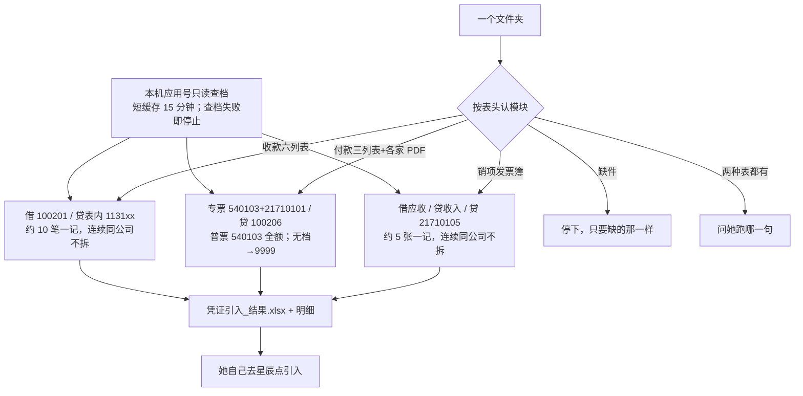

# 金蝶入账（kingdee-posting）

> 一句话定位：放好一个文件夹，说「销项发票入金蝶 / 付款入金蝶 / 收款入金蝶」→ 技能填官方「凭证引入」表。**人过目后自己去金蝶点引入**；技能不点引入、审核、过账。

## 启动时说

对 opencode 说下面任一句（文件放好，路径一起说）：

- **推荐**：销项发票入金蝶 / 付款入金蝶 / 收款入金蝶
- 也可：琪哥发票入金蝶（仍进销项） / 发票入金蝶 / 供应商付款入金蝶 / 收款入账
- 不是这个：更新财务skills（那是拉代码，不记账）

> 三个模块**分开说**。夹里不止一种表时，技能会问你要跑哪一句。

## 1. 这个技能干嘛

月底把销项发票、供应商付款、银行收款做成金蝶能导入的凭证。以前靠人看表、去档案里对编码、手填引入模板。本技能按表头认是哪一块，缺材料只要缺的那一样；齐了由脚本算分录，交出引入表。

## 2. 没有它的时候她怎么做（手工流程）

| 步 | 她手工怎么做 | 痛在哪 |
|---|---|---|
| 1 | 打开发票簿 / 付款台账+PDF / 收款表 | 列多、专普要一张张认 |
| 2 | 去金蝶查客户、供应商、职员、部门编码 | 抬头和档案名经常不完全一样 |
| 3 | 按约 5 张（销项）或 10 笔（收款）打成一记；连续同公司不拆 | 硬切会把同一家拆到两记 |
| 4 | 填官方引入模板，再自己去星辰点引入 | 辅助维少填/多填整张失败 |

> 手工大约半天到一天；技能只填表，**引入仍是她点**。

## 3. 现在怎么用（人 + AI 怎么配合）

**她只需要做三件事**：放文件夹 → 说一句话 → 看一眼产出，自己去金蝶引入。

| 谁 | 做什么 |
|---|---|
| **她** | 把当批材料放进一个文件夹，说上面那句 |
| **AI** | 认表 → 调 `scripts/convert.py` → 同一文件夹交出 `凭证引入_结果.xlsx` → **停下** |
| **她** | 看待确认；能转的自己去金蝶「凭证引入」 |
| **AI** | 不点引入、审核、过账 |

**她会看到的话长这样**：

```
这批 30：可入账 28，待确认 2。填好的金蝶表在 <路径>。请您看待确认，再自己去金蝶引入。我没有点引入。
```

**AI 不许做的**：猜公安映射；编客户/供应商编码；把客户名/金额打进对话；要她改文件名；要金蝶登录密码。

## 4. 一图看懂



历史方案总图（8/26，黄条「空账」已过期，总部已改绑）：


## 5. 输入 / 输出

| 模块 | 她给什么 | 输出 |
|------|----------|------|
| 销项发票 | 改样发票簿（可无发票号、可无组织架构 sheet） | `凭证引入_结果.xlsx` + 明细 |
| 付款 | 三列表（供应商 / 应付金额本币 / 开户名）+ 一家一个夹，夹里 PDF | 同上 |
| 收款 | 六列：日期 / 客户名称 / 借方（增加）/ 销售 / 部门编码 / 应收账款编码 | 同上 |
| 技能自带 | `config/凭证引入空模.xlsx` | 不要另要空模 |

待确认行进明细、不进引入表。所有客户、供应商、部门、职员均须被本次金蝶只读档案快照唯一核验；输入表和组织架构 sheet 不是档案真相源。

## 6. 触发词

销项发票入金蝶 / 付款入金蝶 / 收款入金蝶 / 琪哥发票入金蝶 / 发票入金蝶 / 供应商付款入金蝶 / 收款入账 / 金蝶入账

## 7. 会变的在哪（改表不改码）

| 文件 | 改什么 |
|------|--------|
| `config/rules.json` | 科目、几张一记、部门 0405、银行科目 |
| `config/列名别名.json` | 表头换了加别名 |
| `config/客户别名.json` | 收款三户书面映射；平度公安不要加 |
| `config/凭证引入空模.xlsx` | 金蝶换官方模板时整份替换 |
| `config/业务规则.md` · `config/场景/` | 人话口径（数字以 json 为准） |
| 本机 `~/.config/finance/kingdee.local.json` | 开放平台应用号；**不进 git、更新不覆盖** |

## 8. 怎么跑

```bash
python3 "<本skill目录>/scripts/convert.py" --inspect --input-dir <目录>
python3 "<本skill目录>/scripts/convert.py" --input-dir <目录> --scene 销项发票
# 付款 / 收款 把 --scene 换成对应模块
```

可加 `--date YYYY-MM-DD`（默认当天）。档案查询是必需闸门；`--no-api` 会明确失败，防止误产出空编码引入表。档案从金蝶官方接口读取，默认只在本机复用 15 分钟缓存；缓存失效且查询失败时不产出。

## 9. 验收口径

- 仓内：`python -m pytest -q skills/kingdee-posting/tests skills/qige-invoice-to-kingdee/tests` 合成用例全绿
- 销项：连续同公司不拆；可无组织架构 sheet，但业务行部门编码须在 API 档案中存在
- 付款：专票拆进项、普票全额；认不清专普 hold
- 收款：10 笔一记且连续同公司不拆；三户映射；平度公安 hold
- 无本机密钥、API 不可用且无新鲜缓存时，不得产出 `凭证引入_结果.xlsx`

## 10. 数据红线与已知边界

- 真实发票、台账、密钥不进本仓（GitHub/Gitee 是公开仓）
- 不点引入 / 审核 / 过账；不新建客户档案
- 湖南分公司不做
- 8 月 19 日付款全量记-75 已引入，不要再导同一份
- 平度市公安局无映射，保持 hold

---

## 11. 金蝶后台：链接 + 怎么维护（必看）

同事日常**不用**进开放平台。下面给改绑定、换密钥、核对账套、自己去引入的人。

更细的工程纪律：[`references/维护.md`](references/维护.md)。

### 11.1 先打开哪个网站

| 干什么 | 链接 | 认什么 |
|--------|------|--------|
| **开放平台**（应用 ID、企业授权、是不是总部） | https://open.jdy.com/#/home | 应用「甲骨易财务连接器」，Client ID **357164** |
| **云星辰工作台**（进账套、凭证引入） | https://service.jdy.com/workbench/web/index.html | 服务 ID **795589109148** = 总部；不要湖南分公司 |
| 接口说明 | https://open.jdy.com/ | 只读查档；技能不写凭证 |

管理员号才能改授权。**不要金蝶登录密码写进技能、Word、飞书。** 第一次本机只要开放平台的应用 ID 和密钥。

### 11.2 认应用（开放平台 · 应用信息）

路径：开放平台 → 我的应用 → **甲骨易财务连接器** → 页签「应用信息」。


> 示意图，对照 2026-08-27 现网整理，手机号已涂。请以真页面为准。

在这一页确认：

- 应用名称 = 甲骨易财务连接器
- 应用 ID（Client ID）= `357164`
- 产品线 = 金蝶云星辰
- 类型 = 企业内部应用（自建）

Client Secret **只在本机填一次**，不要截进 git / 手册。

### 11.3 认账套有没有绑总部（开放平台 · 企业授权）

路径：同一应用 → 页签「企业授权」。


> 示意图。密钥、AppKey、实例号已涂。看绿字「已授权」和总部服务 ID。

必须同时看到：

- 企业 / 账套名称：甲骨易（北京）语言科技股份有限公司
- 服务 ID：`795589109148`
- 授权状态：已授权
- 有效期：现网到 **2027-08-20**（到期找明昊，不要自己点续费）

若绑的是空账或其他服务 ID：**先解绑再授权总部**。未书面批准不要新买许可。

本机配置文件（权限 600，不进仓）：

```text
~/.config/finance/kingdee.local.json
```

「更新财务skills」**不得覆盖**这份。同事电脑没有它也能出引入表，只是档案编码可能是空的。

### 11.4 她自己去引入（星辰 · 凭证引入）

工作台进**总部**账套后：财务会计 → 总账 → **凭证引入**。选技能交出的 `凭证引入_结果.xlsx`，由她点「开始引入」。技能不代替这一步。


> 入口示意，不是自动操作。黄条提醒：先选总部，不要进湖南分公司。

### 11.5 改业务口径时动哪

1. 书面口径变了（斯佳/王琪）→ 先改 `specs/010-kingdee-posting/` 或本夹 `config/`，禁止脚本里猜。
2. 科目、打包、0405 → `config/rules.json` + `config/业务规则.md` 同一 commit。
3. 表头换了 → `config/列名别名.json`。
4. 收款客户书面映射 → `config/客户别名.json`（平度公安不要擅自加）。
5. 金蝶官方空模换了 → 整份替换 `config/凭证引入空模.xlsx`。
6. 逻辑一变：测试 + README 这张 Mermaid **同一个 commit** 改掉。

### 11.6 软件工程（本仓库强制，改完对照）

| 条 | 要求 |
|----|------|
| 需求 | 新口径走 Spec Kit，`specs/010-kingdee-posting/` 是需求正本 |
| 算钱 | 只 `scripts/convert.py`；禁止 agent 自写 Python 读真表 |
| 测试 | 先红后绿；`pytest` 用真实退出码，禁止 `\| tail` |
| 仓库 | 真票/真台账/密钥不进 git（仓是公开的） |
| 工位 | 复用 `finance-skills` 正式 clone 的 `main`，不开第二间 |
| 发布 | 测绿 commit；**push 须明昊点头**；同事再说「更新财务skills」 |
| 白名单 | 本技能 id 必须在 `update-finance-skills/config/pack.json` |
| 兼容 | 旧 `qige-invoice-to-kingdee` 触发仍进销项，测试保留 |
| 核销 | 李尚代码只合 `ar-hexiao-daily/`；金标差 2 笔不改他的规则凑绿 |

本地资料家（不进本仓）：`项目/长期项目/财务部skills/技能/金蝶/`。
