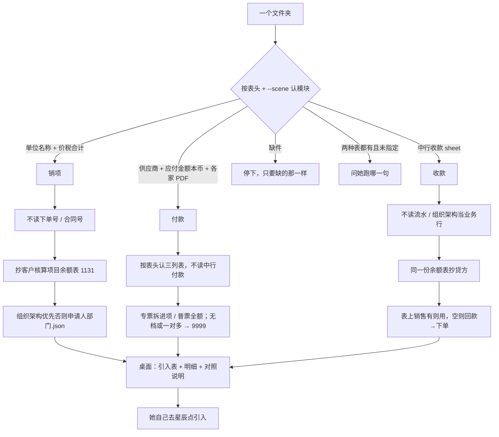
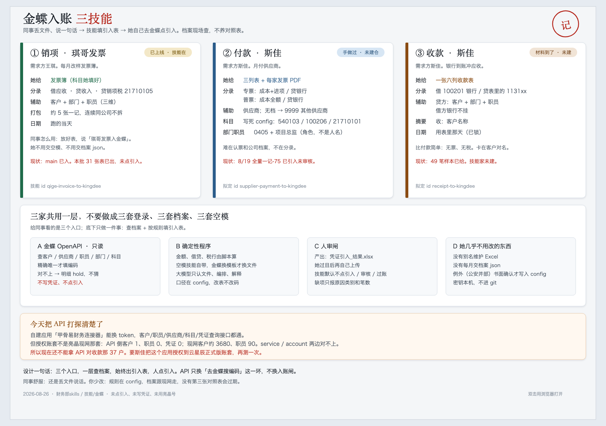
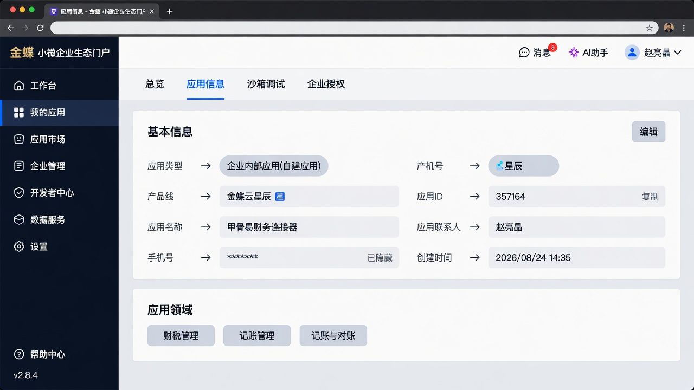
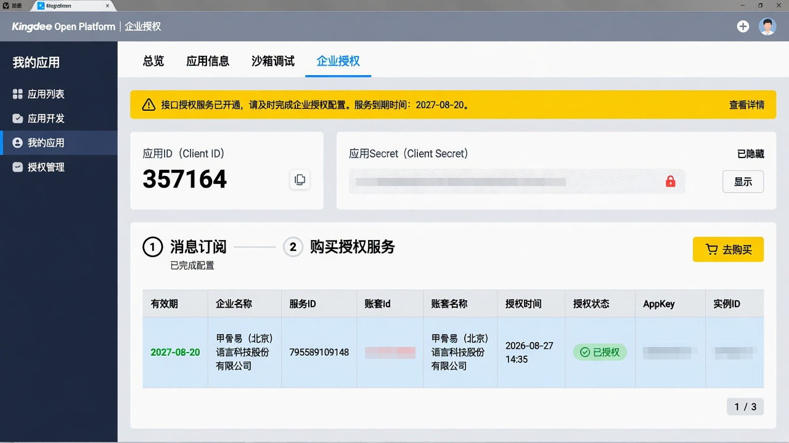
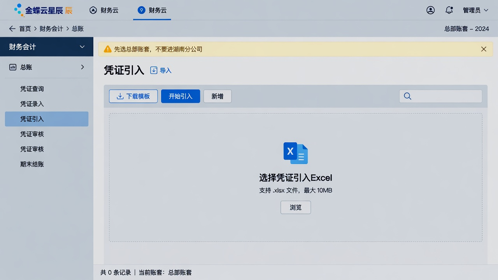

# 金蝶入账（kingdee-posting）

> 一句话定位：放好一个文件夹，说「销项发票入金蝶 / 付款入金蝶 / 收款入金蝶」→ 技能填官方「凭证引入」表。**人过目后自己去金蝶点引入**；技能不点引入、审核、过账。

## 启动时说

对 opencode 说下面任一句（文件放好，路径一起说）：

- **推荐**：销项发票入金蝶 / 付款入金蝶 / 收款入金蝶
- 也可：琪哥发票入金蝶（仍进销项） / 发票入金蝶 / 供应商付款入金蝶 / 收款入账
- 不是这个：更新财务skills（那是拉代码，不记账）

> 三个模块**分开说**。夹里不止一种表时，技能会问你要跑哪一句。

## 1. 这个技能干嘛

月底把销项发票、供应商付款、银行收款做成金蝶能导入的凭证。以前靠人看表、对编码、手填引入模板。本技能按**表头**认模块，缺材料只要缺的那一样；齐了由 `scripts/convert.py` 补科目/销售、算分录。

三个入口共用一份客户核算项目余额表（`assist_xlsx` + `pick_assist_account`）抄 1131。不看下单号/合同号，不用智云业务线，不扫凭证往来窗口。没说凭证号时 = 现网当月最大 + 1，查询失败整批停。默认出到桌面三夹，互不覆盖。

## 2. 没有它的时候她怎么做（手工流程）

| 步 | 她手工怎么做 | 痛在哪 |
|---|---|---|
| 1 | 打开发票簿 / 付款台账+PDF / 收款表 | 列多、专普要一张张认 |
| 2 | 去金蝶查客户、供应商、职员、部门编码 | 抬头和档案名经常不完全一样 |
| 3 | 按约 5 张（销项）或 10 笔（收款）打成一记；连续同公司不拆 | 硬切会把同一家拆到两记 |
| 4 | 填官方引入模板，再自己去星辰点引入 | 辅助维少填/多填整张失败 |

> 手工大约半天到一天；技能只填表，**引入仍是她点**。

## 3. 现在怎么用（人 + AI 怎么配合）

**她只需要做三件事**：放文件夹 → 说一句话 → 看一眼产出，自己去金蝶引入。

| 谁 | 做什么 |
|---|---|
| **她** | 把当批材料放进一个文件夹，说上面那句 |
| **AI** | 认表 → 调 `scripts/convert.py` → 桌面交出引入表 + 明细 + 对照说明 → **停下** |
| **她** | 看待确认；能转的自己去金蝶「凭证引入」 |
| **AI** | 不点引入、审核、过账 |

默认输出（日期=跑的当天）：

- `~/Desktop/金蝶入账_销项_YYYYMMDD/`
- `~/Desktop/金蝶入账_付款_YYYYMMDD/`
- `~/Desktop/金蝶入账_收款_YYYYMMDD/`

每夹：`凭证引入_结果.xlsx`、`*_明细结果.xlsx`、`对照说明.md`（只报笔数、原因类别、sheet、起始凭证号、余额表文件名）。

**她会看到的话长这样**：

```
这批 30：可入账 28，待确认 2。填好的金蝶表在 <路径>。请您看待确认，再自己去金蝶引入。我没有点引入。
```

**AI 不许做的**：猜公安映射；编客户/供应商编码；把客户名/金额打进对话；要她改文件名；要金蝶登录密码。

## 4. 一图看懂



8/26 总图（黄条「空账」已过期，总部已改绑，口径以本节和 `config/业务规则.md` 为准）：



### 4.1 三入口怎么算

| | 销项发票 | 付款 | 收款 |
|--|--|--|--|
| 认表 | 发票 / 数电票-专票；单位名称+价税合计 | 表头定位三列表（第一个 sheet 不是也能认） | **中行收款**；缺部门编码列不失败 |
| 不认 | 下单号、合同号、表内科目 | 月底稿「中行付款」「中行流水」；不要再导记-75 | 中行流水、组织架构当业务行；表内应收编码 |
| 科目 | 抄余额表 1131；一条用、两条期末问、没有问新建。收入 5101+后两位 | 专票：540103+21710101 / 贷 100206。普票：540103 全额 / 贷 100206 | 贷方同销项，抄同一份余额表 |
| 部门 / 人 | 组织架构优先，否则 `申请人部门.json`。职员无档/一对多 hold | 0405 + 项目总监（须档案核验） | 表上部门编码，否则组织架构按销售 |
| 销售 | （申请人当职员） | — | 表上有则用；空则智云回款→下单。没智云仍出明细 |
| 特殊 | 公安除陈霞+海淀外→0386；人名→个人 | 无档/一对多→9999；PDF 缺票种/销售方/金额该家 hold | 海淀分局**不并** 0386。职员对不上留空仍入账 |
| 记账日 | 跑批当天 | 跑批当天 | **表上收款日** |
| 打包 | 约 5 张一记，连续同公司不拆 | 一家一记 | 约 10 笔一记，连续同公司不拆，换日另记 |

**闸门**：金蝶档案失败或当月凭证号查不到 → 不出引入表。智云只给收款补空销售；失败不得整批空表。

## 5. 输入 / 输出

| 模块 | 她给什么 | 技能补什么 | 输出 |
|------|----------|------------|------|
| 销项发票 | 发票簿：单位名称、价税合计、申请人 | 余额表→应收/收入；组织架构优先否则申请人部门.json | 桌面 `金蝶入账_销项_YYYYMMDD/` |
| 付款 | 三列表 + 一家一个夹（夹里 PDF） | 科目固定；无档/一对多→9999 | 桌面 `金蝶入账_付款_YYYYMMDD/` |
| 收款 | 月底稿或收款表（中行收款 sheet） | 贷方抄余额表；表上销售优先，空则回款→下单 | 桌面 `金蝶入账_收款_YYYYMMDD/` |
| 技能自带 | `config/凭证引入空模.xlsx` | | 不要另要空模 |

待确认行进明细、不进引入表。客户/供应商/部门/职员须被本次金蝶只读档案唯一核验（收款职员对不上则留空仍入账）。无金蝶档案不出引入表。

## 6. 触发词

销项发票入金蝶 / 付款入金蝶 / 收款入金蝶 / 琪哥发票入金蝶 / 发票入金蝶 / 供应商付款入金蝶 / 收款入账 / 金蝶入账

## 7. 会变的在哪（改表不改码）

| 文件 | 改什么 |
|------|--------|
| `config/rules.json` | 税/银行科目、几张一记、付款 0405 |
| `config/rules.json` `ar_accounts` | 要查的 1131xx 列表 |
| `config/申请人部门.json` | 销项申请人 → 部门编码（组织架构没有时才用） |
| `config/列名别名.json` | 表头换了加别名 |
| `config/客户别名.json` | 三户书面映射 |
| `config/职员挂靠.json` | 童睿智、赵贺斌 → 郑瑞 |
| `config/凭证引入空模.xlsx` | 金蝶换官方模板时整份替换 |
| `config/业务规则.md` · `config/场景/` | 人话口径（数字以 json 为准） |
| 本机 `~/.config/finance/kingdee.local.json` | 开放平台应用号；**不进 git、更新不覆盖** |
| 本机 `~/.config/finance/zhiyun.local.json` | 智云账号；**不进 git、更新不覆盖** |

## 8. 怎么跑

```bash
python3 "<本skill目录>/scripts/convert.py" --inspect --input-dir <目录>
python3 "<本skill目录>/scripts/convert.py" --input-dir <目录> --scene 销项发票
# 付款 / 收款 把 --scene 换成对应模块
# 系统 python3 会自动切到仓内 .venv（里面才有 requests / playwright）
```

没给 `--out-dir` 时按模块写到上面三份桌面夹。可加 `--date YYYY-MM-DD`（销项/付款默认当天；收款行上用表上收款日）。`--no-api` 会明确失败。合成测试可加 `--master` / `--lookups` JSON，生产不要用假档案出表。

## 9. 验收口径

- 仓内：`python -m pytest -q skills/kingdee-posting/tests skills/qige-invoice-to-kingdee/tests` 合成用例全绿
- 销项：不读下单号/合同号；科目抄余额表；组织架构优先；凭证号默认当月最大 + 1
- 付款：按表头认三列表；专票拆进项、普票全额；一对多→9999
- 收款：读中行收款；表上销售优先；海淀不并 0386；没智云仍出明细；记账日=表上收款日
- 无金蝶应用号、档案失败或当月凭证号查不到时不得出引入表

## 10. 数据红线与已知边界

- 真实发票、台账、密钥不进本仓（GitHub/Gitee 是公开仓）
- 不点引入 / 审核 / 过账；不新建客户档案；不写智云
- 禁止看发票「下单号」「合同号」；禁止用智云业务线/下单额定科目；禁止扫凭证定 1131
- 湖南分公司不做
- 8 月 19 日付款全量记-75 已引入，不要再导同一份
- 销项公安除陈霞+海淀外归 0386；收款海淀分局不并 0386；人名抬头走「个人」

---

## 11. 金蝶后台：链接 + 怎么维护

同事日常**不用**进开放平台。下面给改绑定、换密钥、核对账套、自己去引入的人。更细的工程纪律：[`references/维护.md`](references/维护.md)。

### 11.1 先打开哪个网站

| 干什么 | 链接 | 认什么 |
|--------|------|--------|
| **开放平台**（应用 ID、企业授权、是不是总部） | https://open.jdy.com/#/home | 应用「甲骨易财务连接器」，Client ID **357164** |
| **云星辰工作台**（进账套、凭证引入） | https://service.jdy.com/workbench/web/index.html | 服务 ID **795589109148** = 总部；不要湖南分公司 |
| 接口说明 | https://open.jdy.com/ | 只读查档；技能不写凭证 |

管理员号才能改授权。**不要金蝶登录密码写进技能、Word、飞书。** 第一次本机只要开放平台的应用 ID 和密钥。

### 11.2 认应用（开放平台 · 应用信息）

路径：开放平台 → 我的应用 → **甲骨易财务连接器** → 页签「应用信息」。



> 示意图，对照 2026-08-27 现网整理，手机号已涂。请以真页面为准。

确认：应用名称 = 甲骨易财务连接器；Client ID = `357164`；产品线 = 金蝶云星辰；类型 = 企业内部应用（自建）。Client Secret **只在本机填一次**，不要截进 git。**不要在开放平台点重置密钥**。

### 11.3 认账套有没有绑总部（开放平台 · 企业授权）

路径：同一应用 → 页签「企业授权」。



> 示意图。密钥、AppKey、实例号已涂。看绿字「已授权」和总部服务 ID。

必须同时看到：企业 / 账套名称「甲骨易（北京）语言科技股份有限公司」；服务 ID `795589109148`；授权状态已授权；有效期现网到 **2027-08-20**（到期找明昊，不要自己点续费）。

本机配置（权限 600，不进仓）：`~/.config/finance/kingdee.local.json`。「更新财务skills」**不得覆盖**这份，也不得覆盖 `zhiyun.local.json`。没有金蝶应用号时**不得出引入表**。收款缺智云仍出明细。

### 11.4 她自己去引入（星辰 · 凭证引入）

工作台进**总部**账套后：财务会计 → 总账 → **凭证引入**。选技能交出的 `凭证引入_结果.xlsx`，由她点「开始引入」。技能不代替这一步。



> 入口示意，不是自动操作。黄条提醒：先选总部，不要进湖南分公司。

### 11.5 改业务口径时动哪

1. 书面口径变了（斯佳/王琪）→ 先改 `config/` 与 `config/业务规则.md`，禁止脚本里猜。
2. 科目、打包、0405 → `config/rules.json` 同一 commit。
3. 表头换了 → `config/列名别名.json`。
4. 金蝶官方空模换了 → 整份替换 `config/凭证引入空模.xlsx`。
5. 逻辑一变：测试 + README 这张 Mermaid **同一个 commit** 改掉。

### 11.6 软件工程

| 条 | 要求 |
|----|------|
| 算钱 | 只 `scripts/convert.py`；禁止 agent 自写 Python 读真表 |
| 测试 | `pytest` 用真实退出码，禁止 `\| tail` |
| 仓库 | 真票/真台账/密钥不进 git（仓是公开的） |
| 发布 | 测绿 commit；push 后同事再说「更新财务skills」才拉到本机 |
| 白名单 | 本技能 id 必须在 `update-finance-skills/config/pack.json` |
| 兼容 | 旧 `qige-invoice-to-kingdee` 触发仍进销项，测试保留 |

本地资料家（不进本仓）：`项目/长期项目/财务部skills/技能/金蝶/`。
