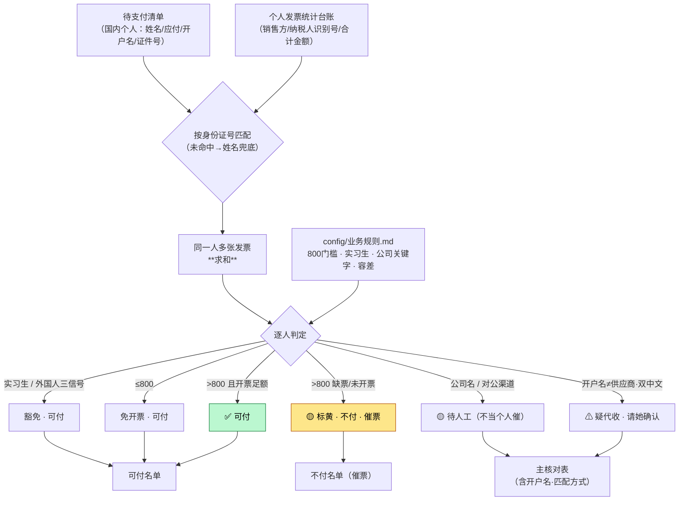

# 劳务发票核对（labor-invoice-check）

> 一句话定位：待支付清单（国内个人）× 发票统计台账 → 按**身份证号**核对谁足额开票了
> → 出「主核对表 + 不付名单(催票) + 可付名单」。**只核对、不付款、不发催票邮件**。

## 1. 这个技能干嘛

财务部每月给个人供应商（freelancer、实习生）付译费/劳务费之前，
要先确认**谁开了发票、开够没有**——按规定个人提供劳务超过 800 元需开增值税发票，
没开或开不够的这次先不付、催票。

难点在**匹配**：一个人可能开好几张发票要合计；有人用个体户税号；
有外籍供应商压根不用开；还有些走对公渠道根本不该混在个人清单里。

本技能把这套匹配 + 判定固化成脚本，直接给出**能付 / 不能付**两份名单。

## 2. 没有它的时候她怎么做（手工流程）

| 步 | 她手工怎么做 | 痛在哪 |
|---|---|---|
| 1 | 打开待支付清单（几百人）和发票台账（更多行） | 两张表来回切 |
| 2 | 逐个人在台账里找他的发票 | **一人多张要手工求和**；名字重名、税号写法不一 |
| 3 | 比对开票合计 ≥ 应付金额？ | 几百次比对，纯体力 |
| 4 | 挑出实习生、外籍——这些不用开票 | **靠记忆判断谁是外籍**，容易误催 |
| 5 | 剔掉公司名/对公渠道混进来的行 | 一不留神就当个人催票 |
| 6 | 标黄缺票的，整理催票名单和可付名单 | — |

> 真实数据 **464 人**规模；最容易出错的是**一人多张票没合计**和**误催外籍/实习生**。

## 3. 现在怎么用（人 + AI 怎么配合）

**她只需要做两件事**：扔两个 Excel → 说一句话。

| 谁 | 做什么 |
|---|---|
| **她** | 把待支付清单 + 发票台账放好，说「**核对劳务发票**」 |
| **AI** | 认两张表 → 按身份证号匹配求和 → 判定豁免/放行/缺票 → 出三份名单 + 运行报告 |
| **AI** | 有拿不准的（疑似代收、陌生公司名）→ 标出来问她，不擅自归类 |
| **她** | 看可付名单去付款；看不付名单去催票 |

**判定规则**（都在 `config/业务规则.md`，改表不改码）：

| 情况 | 怎么判 |
|---|---|
| 同一人多张发票 | **按身份证号求和**；身份证没命中用**姓名兜底**（个体户税号常见） |
| 实习生 | 豁免，不催票 |
| 外国人 | 豁免——**三信号**识别：供应商英文名（去括号昵称）/ 开户名英文 / 护照号 |
| 金额 ≤ 800 | 免开票，放行 |
| 金额 > 800 且开票不足 | **标黄 → 进不付名单、催票** |
| 公司名 / 支付渠道=对公 | 标黄「待人工」——不当个人催 |
| 开户名 ≠ 供应商且双方都是中文名 | 提示「**疑代收**」，请她确认 |

**AI 不许做的**：⛔ 不发催票邮件；⛔ 不执行付款；⛔ 不把身份证号、账号、金额明细刷进对话。

## 4. 一图看懂



## 5. 输入 / 输出

| 输入 | 处理 | 输出 |
|---|---|---|
| 待支付清单（国内个人）+ 个人发票统计台账 | 身份证求和匹配 + 豁免/门槛判定 | `主核对表` + `不付名单(催票)` + `可付名单` + `运行报告`（含开户名、匹配方式） |

## 6. 触发词

核对劳务发票 / 个人译费发票核对 / 付款前查谁开票了 / 谁没开票不能付 / 劳务发票核对 / 查开票总额够不够应付

## 7. 会变的在哪（改表不改码）

| 文件 | 改什么 |
|---|---|
| `config/业务规则.md` | 800 门槛、金额容差、实习生名单、公司关键字 |
| `config/列名别名.json` | 两张表列名变了加别名 |

## 8. 怎么跑

```bash
python3 scripts/check.py --inspect --input-dir <目录>                       # 先认文件
python3 scripts/check.py --list 待支付清单.xlsx --invoice 发票台账.xlsx --out 结果.xlsx
python3 tests/test_robustness.py                                            # 回归
```

## 9. 验收口径

- 回归 **21/21 全绿**（合成金标 + 真实冒烟）
- 真实数据 **464 人**规模验证通过
- **待亮晶用真实月份完整验收一轮**

## 10. 数据红线与已知边界

- 清单含**身份证号 / 银行账号 / 电话等 PII**——只在本机跑、结果别外传、对话不回显
- 只做核对（第一阶段）：**不发催票邮件、不执行付款、不改台账**
- 「疑代收」只提示不判定，最终由她确认

### v1.1 补洞记录（2026-07 亮晶真实验收）

| 坑 | 修法 |
|---|---|
| 中文名外籍被误催票 | 外国人三信号：供应商英文(去括号昵称) / 开户名英文 / 护照号 |
| 有票却判无票 | 身份证主匹配 + **姓名兜底**（个体户税号场景） |
| 公司行混进催票名单 | 公司关键字 / 支付渠道=对公 → 标黄待人工 |
| 看不出代收 | 开户名≠供应商且双中文 → 提示「疑代收」 |
