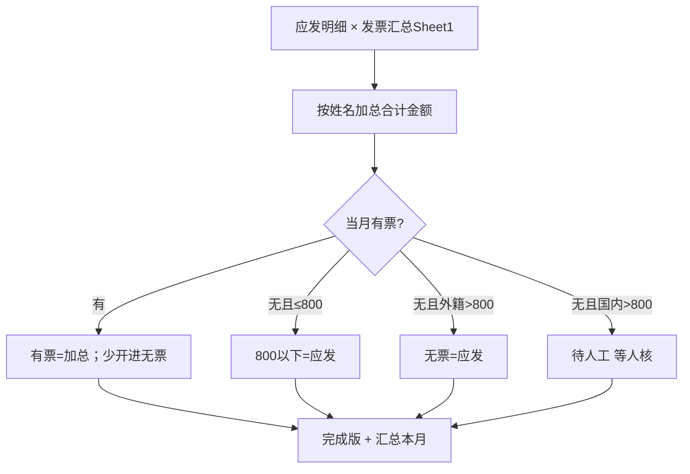

# 劳务发票核对（labor-invoice-check）

> 一句话定位：劳务费用明细（应发已付）× 个人发票汇总 Sheet1 → 按**姓名加总**拆成有票 / 800以下 / 无票。**不做付款、不催票。**

## 启动时说

- **推荐**：做这个月的劳务发票统计
- 也可：劳务发票核对 / 劳务发票做账 / 对完成版

## 1. 这个技能干嘛

亮晶每月初要把已经发出去的劳务费，按人拆成三列，做出能向上交的完成版。  
她手工用 VLOOKUP，一人多张会漏。本技能把加总和分列写成脚本。

## 2. 没有它的时候她怎么做

| 步 | 她手工怎么做 | 痛在哪 |
|---|---|---|
| 1 | 应发粘到空表，VLOOKUP 发票汇总 | **一人多张只命中第一张** |
| 2 | 对不上的去服务器按人名搜 PDF | **现网先不做**，进待人工等人核 |
| 3 | 绿/黄/红标色，再抄进完成版三列 | 无票要作差，不能抄 check |

## 3. 现在怎么用

| 谁 | 做什么 |
|---|---|
| **她** | 把应发明细 + 当月发票汇总放进一个夹（完成版、上月发票可以一起放），说「做这个月劳务发票统计」 |
| **AI** | `--inspect` 认对文件和月份 → 跑 `monthly_close.py` → 出完成版 + 待人工 |
| **AI** | `ask=` 原样问她人核。空格括号全角由脚本吃，对不上不猜、不去共享盘 |
| **她** | 打开「待人工」核对完，再对汇总右边 |

## 4. 一图看懂



## 5. 输入 / 输出

| 输入 | 处理 | 输出 |
|---|---|---|
| 劳务费用明细 + 个人发票汇总（可选金标） | 姓名加总 + 三列 + 待人工 | `一般劳务明细` + `待人工` + `汇总_本月` + `运行报告` |

## 6. 触发词

做这个月劳务发票统计 / 劳务发票核对 / 劳务发票做账 / 有票无票800以下 / 对完成版

## 7. 会变的在哪

| 文件 | 改什么 |
|---|---|
| `config/业务规则.md` | 800 门槛、容差、单独写单启发式 |
| `config/列名别名.json` | 两张表列名 |

## 8. 怎么跑

```bash
python3 scripts/monthly_close.py --inspect --input-dir <目录>
python3 scripts/monthly_close.py --pay 应发.xlsx --invoice 发票汇总.xlsx --month 202608 --out 完成版.xlsx
python3 tests/test_monthly_close.py
```

## 9. 验收口径

- 合成测试全绿。
- 2026-08 本地冒烟（不进仓）：应发 258；当月姓名加总 191；待人工 17（11 人核 + 6 单独写单）；金标有票 208。差口等人核，不去服务器取数。
- 本机 opencode `big-pickle`：同事口径「做这个月劳务发票统计」先 inspect 认对 8 月发票+完成版，再出表；不跑旧 `check.py`。

## 10. 数据红线

含身份证 / 发票。只在本机跑。对话只报笔数。禁止把 SSH / 内网路径写进 skill。
