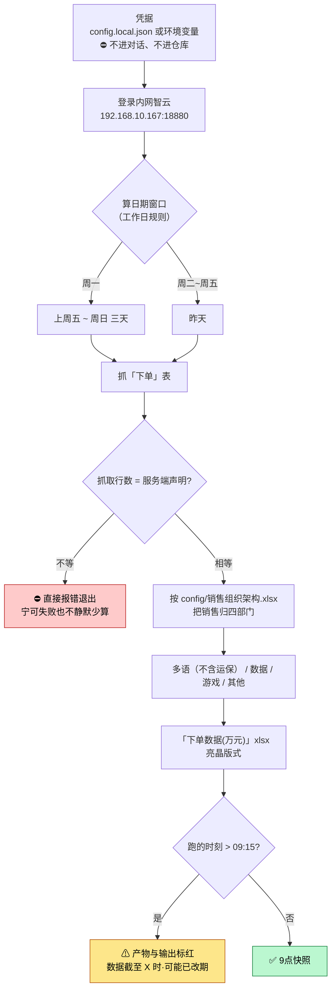

# 九点下单统计（order-daily-summary）

> 一句话定位：登录内网智云抓「下单」表 → 按组织架构归 **多语（不含运保）/ 数据 / 游戏 / 其他**
> → 出亮晶版式「下单数据(万元)」xlsx。**这是「9 点快照」口径**，晚跑数字会变，不是 bug。

## 1. 这个技能干嘛

每个工作日早上要报一张「昨天各部门下了多少单（万元）」给领导。
数据在内网智云里，要登录、按日期筛、把每个销售归到部门、再按亮晶的版式汇总。

**部门口径来自 `config/销售组织架构.xlsx`**（本地化 → 多语不含运保），
**不是**智云表里那个「部门」字段——这两个口径不一样，用错就报错数。

## 2. 没有它的时候她怎么做（手工流程）

| 步 | 她手工怎么做 | 痛在哪 |
|---|---|---|
| 1 | 登录智云，进「下单」表 | — |
| 2 | 按日期筛（周一要筛上周五～周日三天） | **工作日规则容易搞错**，周一少筛两天就漏数 |
| 3 | 导出，逐个销售查他属于哪个部门 | **最耗时**：智云里的「部门」字段口径不对，得对着组织架构表查 |
| 4 | 按四个部门汇总、换算成万元 | 手工加总 + 舍入 |
| 5 | 套亮晶版式排版 | 每天重做一遍 |

> 每天早上都要做一遍；最容易出错的是**周一的日期窗口**和**销售归错部门**。

## 3. 现在怎么用（人 + AI 怎么配合）

**她只需要说一句话**（凭据事先配好一次）。

| 谁 | 做什么 |
|---|---|
| **她（一次性）** | 配好凭据：`config.local.json` 或环境变量。⛔ **别把密码打进对话** |
| **她（每天）** | 说「**跑下单汇总**」／「**九点下单**」 |
| **AI** | 登录智云 → 按**工作日规则**算日期窗口 → 抓下单 → 按组织架构归四部门 → 出 xlsx |
| **AI** | 晚于 09:15 跑 → **在产物和输出里标红提示**"数据截至 X 时、可能已改期" |
| **她** | 拿表报数 |

**⚠ 「9 点快照」口径（重要，别当 bug）**：
智云的「下单日期」**可以被编辑**——昨天的订单今天可能被改期、单号重排
（实测：某单从 7-23 挪到 7-24，SO 随之重排）。
所以「昨日下单额」只在**某个时刻**才是确定的。设计就是**每天 9:00 定时跑取当日快照**。
**同一天不同时刻跑出来数不一样 = 数据动了，不是取数错。**

**AI 不许做的**：⛔ 把账号密码写进对话/命令行；⛔ 抓取行数与服务端声明不符还继续
（**宁可直接报错失败，也不静默少算**）。

## 4. 一图看懂



## 5. 输入 / 输出

| 输入 | 处理 | 输出 |
|---|---|---|
| 智云「下单」表（在线抓）+ `config/销售组织架构.xlsx` | 工作日窗口 + 部门归属 + 万元换算 | 「下单数据(万元)」xlsx（亮晶版式）+ 抓取时刻戳 |

## 6. 触发词

九点下单 / 跑下单汇总 / 统计昨天下单 / 下单数据万元 / 按部门下单 / 亮晶下单统计 / 下单日报

## 7. 会变的在哪（改表不改码）

| 文件 | 改什么 |
|---|---|
| `config/销售组织架构.xlsx` | 谁属于哪个部门（**部门口径的唯一来源**，人员变动改这里） |
| `config/业务规则.md` | 日期窗口规则、部门口径、舍入 |
| `config.local.json` | 凭据——**不进仓库**（`.gitignore` 已挡） |

## 8. 前置与怎么跑

**前置（缺一不可）**：
1. **能连内网** `http://192.168.10.167:18880`（公司网 / VPN / 部署机）
2. **凭据**（二选一）：`config.local.json` 或环境变量 `ZHIYUN_USER` / `ZHIYUN_PASSWORD`

```bash
cp config/config.local.example.json config.local.json    # 再编辑填账号密码
pip install playwright requests openpyxl && playwright install chromium
python3 scripts/run.py --out ./工作区 --detail
python -m pytest tests -q          # 纯函数单测，不连网
```

## 9. 验收口径

- 单测 **24 例**（纯函数、不连网）
- **内网真机复测通过（2026-07-24）**
- 抓取一致性闸：行数与服务端声明不符 → 直接失败

## 10. 数据红线与已知边界

- **凭据只在 `config.local.json` 或环境变量**，绝不进对话、绝不进仓库
- 内网地址与数据不外传
- **只出数不解读**：不改智云、不发报表
- 「9 点快照」是口径不是缺陷；要复现某天的数必须记住抓取时刻

### 已澄清的非 bug

`2.11 ↔ 4.26` 那次对不上**不是抓取 bug**——是智云里那笔单从 7-23 改期到了 7-24。
口径已锁死为「9 点快照」，抓取逻辑不动。
