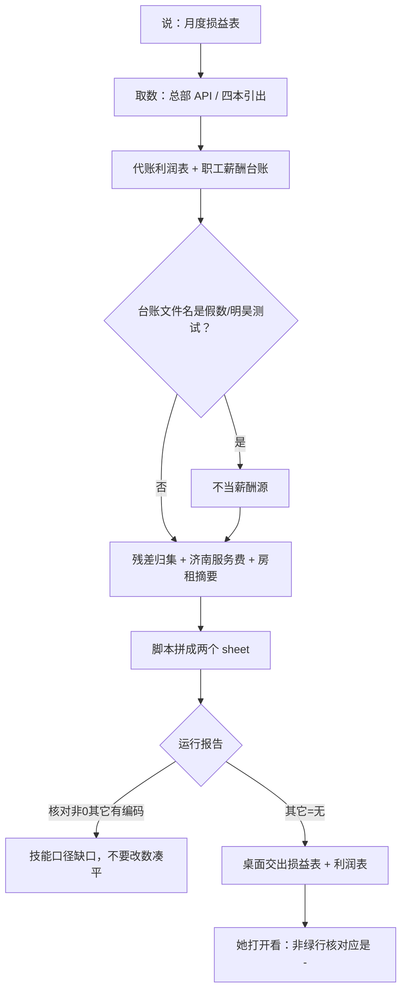

# 月度损益表 / 科目余额表（pl-dept-report）

> 一句话定位：金蝶星辰各账套科目余额 + 部门核算项目 + 利润表本月金额 + 职工薪酬台账 → 斯佳「损益表 + 利润表」Excel；山东/四川/济南吃月更 Excel。发生额与核对同口径（收入贷方、费用借方）。公式自写核对，禁止改数凑平。

## 启动时说

对 opencode 说下面任一句（引出文件放一个文件夹，期间可一起说）：

- **推荐**：月度损益表
- 也可：科目余额表 / 出本月损益表 / 损益表利润表 / 部门科目余额表 / 跑斯佳那张表 / 金蝶损益表

> 这段必须和 `SKILL.md` YAML `description` 里的中文触发词一致。用友「部门费用归集」不是这张表。

## 1. 这个技能干嘛

总账每月要把星辰里有账的主体，拼成一张左公司右部门的分析表，再加一张利润表（最近两个月）。金蝶每本账分开导出，她原来手工粘。本技能替代粘贴和公式核对：有源的列填发生额，没星辰账套的列空着给她手填。

## 2. 没有它的时候她怎么做（手工流程）

| 步 | 她手工怎么做 | 痛在哪 |
|---|---|---|
| 1 | 有星辰的账：账簿 → 科目余额表（5 开头本期借贷）粘到左列 | 五本账来回切 |
| 2 | 同一账套：核算项目余额表（部门）粘到右列，跨公司同部门相加 | **最耗时**：同名部门要对齐、档案名还对不上 Excel 列 |
| 3 | 没账套的（山东/四川/济南）从她每月更新的代账利润表抄 | 利润表没有社保明细 |
| 4 | 利润表抄本月金额；上月整列挪位 | 抄错格、变动率指错 |
| 5 | 核对立着加总为 0 | 格子公式不全，不平就改数 |

> 手工大半天；最容易出错的是空列填 0、部门名猜错、核对改数凑平。

## 3. 现在怎么用（人 + AI 怎么配合）

**她只需要说「月度损益表」**（可带期间）。文件名、摆目录不是她的活。

| 谁 | 做什么 |
|---|---|
| **她** | 说「**月度损益表**」；可说期间 `202608`。已有引出也可以随口给一个文件夹。网页账密只在本机缺文件时问一次 |
| **AI** | 总部只读 API 取甲骨易；另外 4 本先扫工作区/桌面已有引出，没有再跑 `xingchen_export.py`（账密读 `~/.config/finance/xingchen.local.json`）→ 调 `convert.py` → 出两个 sheet + 运行报告 → **停下报路径** |
| **她** | 打开表看列顺序、空列、核对公式；口径要调就改 `config/` 再跑 |

**她会看到的话长这样**：

```
月度损益表已出，期间 202608。有源账套：甲骨易,文化；缺源：上海,山东分公司,…。未映射部门 N 个。核对非 0 的科目编码 M 个。表在 <路径>。
```

**AI 不许做的**：
- ⛔ 改发生额凑平、把核对写成死数
- ⛔ 对话报金额 / 口令 / secret
- ⛔ 解绑总部、点购买 API、点引入/审核/过账
- ⛔ 把用友部门费用技能当成这张表
- ⛔ 读「内网勿外传」口令 md、复用 Chrome 配置目录、把账密打进对话

## 4. 一图看懂



## 5. 输入 / 输出

| 输入 | 处理 | 输出 |
|---|---|---|
| 期间 YYYYMM（默认上月）；可选引出文件夹；山东/四川/济南代账利润表；职工薪酬台账；本机 `kingdee.local.json`；缺引出时本机 `xingchen.local.json` | 总部 API 或引出；4 本星辰账网页引出；三家线下吃利润表本月金额；薪酬台账拆工资/单位社保/公积金 | 默认桌面 `月度损益表_YYYYMMDD/月度损益表_YYYYMM.xlsx` |

左列 8 家顺序：甲骨易、文化、上海、山东分公司、湖南分公司、湖南子公司、四川分公司、济南子公司。

## 6. 触发词

月度损益表 / 科目余额表 / 出本月损益表 / 损益表利润表 / 部门科目余额表 / 跑斯佳那张表 / 金蝶损益表

## 7. 会变的在哪（改表不改码）

| 文件 | 改什么 |
|------|--------|
| `config/账套清单.json` | 主体与星辰账、哪几家吃月更 Excel |
| `config/薪酬台账.json` | 职工薪酬台账怎么进工资/社保/公积金叶子 |
| `config/本公司规则.json` | 文化/上海本公司按科目进哪一列；湖南无辅助的办公费/房租进自己列 |
| `config/残差归集.json` | 折旧/摊销→运保；税金及附加/财务费用→财务中心；540103→项目总监；房租摘要深圳/长沙 |
| `config/部门名映射.json` | 档案名 → Excel 列（产品部→渠道开发中心）；不要写本公司 |
| `config/版式.json` | 科目行、列、冻结（无金额） |
| `config/引出列名.json` | 引出表头别名 |
| `config/科目名同义.json` | 引出科目名 → 版式名 |
| `config/xingchen.local.example.json` | 网页登录字段样例（不要真值） |
| 本机 `kingdee.local.json` | 连接器；不进仓；更新不覆盖 |
| 本机 `xingchen.local.json` | 网页登录手机号/密码；不进仓；更新不覆盖 |
| 本机 `xingchen.playwright-state.json` | 登录会话；过期会再登；不进仓 |

## 8. 怎么跑

```bash
python3 scripts/convert.py --period 202608
# 她给了引出文件夹才加 --input-dir；没给不要加
# 缺四本引出时脚本会调 xingchen_export.py
```

依赖：仓内 `.venv` 的 `openpyxl`、`requests`、网页引出还要 `playwright`。缺库当场清华镜像装，失败再阿里 / 默认源。不要另开环境管家。不要读 `zhiyun.local.json`。

## 9. 验收口径

- `pytest skills/pl-dept-report/tests` 全绿
- 两个 sheet、无确认情况、冻结 C3；山东/四川/济南有月更表则有数，无源则空
- 已拍口径的行：公式重算后核对 ≈ 0（Excel 显示 `-`）
- 绿行没干净台账、未映射部门：可以非 0，不要猜
- 运行报告 `核对非0其它` 必须是无；假数/明昊测试文件名不当薪酬源
- 本机 opencode 说「月度损益表」「科目余额表」命中本技能

## 10. 数据红线与已知边界

- 密钥、真引出、真金额表不进仓库；对话不回显金额
- 另外 4 本星辰账 v1 用网页引出，不加购 KEY、不解绑总部。账密只读 `xingchen.local.json` 或环境变量，不要读斯佳口令 md、不要复用 Chrome 配置目录
- 科目余额期间参数不通时总部改凭证 5 开头汇总；右列优先核算项目余额表引出，没有才退回凭证部门辅助
- 总部工资/社保：有薪酬台账按组织架构拆；没台账且核算项目没有部门就空着问她，不要倒填损益表成品
- 绿行来自薪酬台账。证件号/离谱金额那一行跳过，其余行照加，不要停下来让她改表。文化/上海没有星辰引出时台账补左列。
- 上月利润列没有源就空，禁止复制当月
- 不做确认情况 sheet；不做 MCP；不点引入
