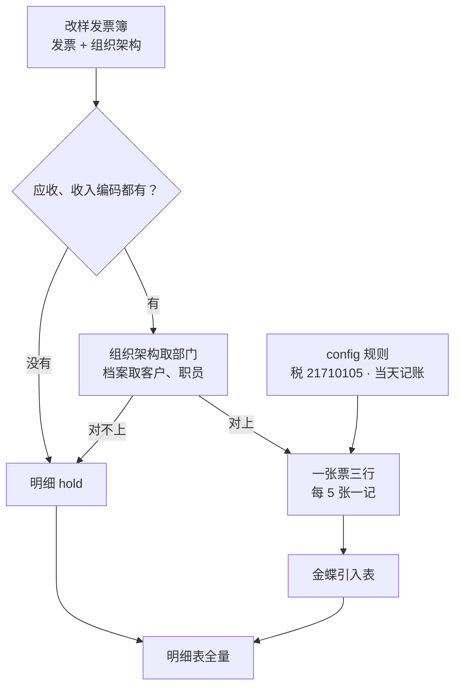

# 琪哥发票入金蝶（qige-invoice-to-kingdee）

> 一句话定位：改样发票簿（发票 + 组织架构）→ 按表内科目和档案匹配 → 明细 + 金蝶凭证引入表。未点金蝶引入。

## 1. 这个技能干嘛

外勤月底把销项发票整理成金蝶能导入的凭证。以前靠人看表、手填引入模板。本技能读她改样后的发票簿，照表里的应收/收入编码写三行分录，客户和职员编码从金蝶档案自己取。

## 2. 没有它的时候她怎么做（手工流程）

| 步 | 她手工怎么做 | 痛在哪 |
|---|---|---|
| 1 | 打开发票表，逐张抄单位、金额、科目 | 一张票要填三行 |
| 2 | 去金蝶查客户编码、职员编码、部门 | 抬头和档案名经常不完全一样 |
| 3 | 按大约 5 张打成一张凭证 | 容易多数、漏数 |
| 4 | 填官方引入模板再上传 | 辅助维少填/多填都会整张失败 |

> 科目以她表里填的为准；技能不替她猜咪咕该挂哪一个 1131。

## 3. 现在怎么用（人 + AI 怎么配合）

**她只需要做两件事**：把改样发票簿（和金蝶档案 json）放好 → 说「琪哥发票入金蝶」。

| 谁 | 做什么 |
|---|---|
| **她** | 给发票簿；档案 json 用本机金蝶引出 |
| **AI** | 认表 → 调 `scripts/convert.py` → 出明细 + 引入表 |
| **她** | 看待确认；能转的自己去金蝶引入 |
| **AI** | 不点引入、审核、过账 |

**她会看到的话长这样**：

```
这批 30 张：可入账 22，待确认 8。两份表在 <路径>。请您看明细里待确认，再自己去金蝶引入。我没有点引入。
```

**AI 不许做的**：猜客户映射；用余额表猜科目；把客户名/金额打进对话；另向她要第三份规则 Excel。

## 4. 一图看懂



## 5. 输入 / 输出

| 输入 | 处理 | 输出 |
|---|---|---|
| 发票簿 | 跳过空行；科目/档案闸 | 明细（可入账 / 待确认） |
| 金蝶档案 json | 名称规范化后精确匹配 | 引入表（只写可入账） |
| 技能自带空模 | 只填不改表名 | 不点金蝶 |

## 6. 触发词

琪哥发票入金蝶 / 发票入金蝶 / 把发票做成凭证引入 / 销项票填金蝶模板 / 开票入账模板 / 金蝶入账

## 7. 会变的在哪（改表不改码）

| 文件 | 改什么 |
|---|---|
| `config/rules.json` | 税科目、几张一记、币别 |
| `config/业务规则.md` | 口径说明 |
| `config/列名别名.json` | 表头别名 |
| `config/凭证引入空模.xlsx` | 金蝶换模板时替换 |

## 8. 怎么跑

```bash
python3 "<本skill目录>/scripts/convert.py" --inspect --input-dir <目录>
python3 "<本skill目录>/scripts/convert.py" --invoice <发票.xlsx> --master <档案.json> --out <目录>
```

## 9. 验收口径

- 仓内：`python -m pytest -q skills/qige-invoice-to-kingdee/tests/test_qige_invoice_to_kingdee.py` 合成用例全绿
- 本机 30 张金标（技能家 `测试数据/run_gold_30.py`）：源 30、可入账 22、待确认 8、引入表 66 行借贷平衡

## 10. 数据红线与已知边界

- 真实发票和档案不进本仓
- 不处理流水/收款/付款
- 档案过期会导致职员/客户 hold（本机 8/3 档案会挡住部分行，属预期）
- 名称只做去空格和半角括号统一，不删「有限公司」
