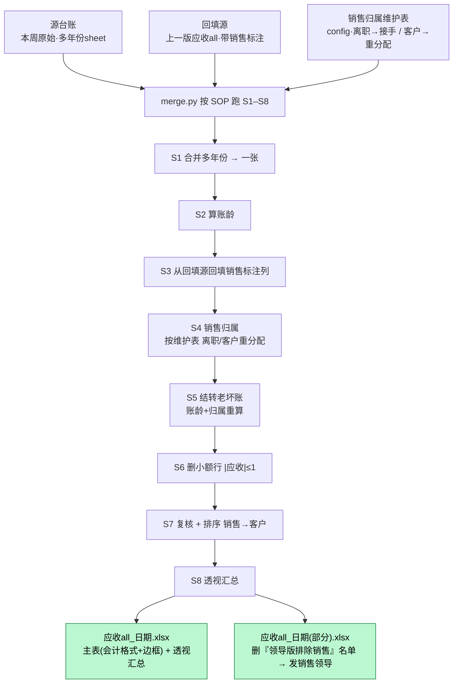

# 应收账款合并（receivables-merge）

> 把每周手工做的「应收账款合并」自动化：多年份分表合一 → 算账龄 → 回填销售标注 → 按维护表做销售归属 →
> 删已回款/极小额行 → 出透视汇总。财务部第一个符合《技能标准规范》的样板技能。

## 这个技能干嘛

财务同事（赵亮晶）每周把「按年份分 sheet 的源台账」合并成一张主「应收 all」。这是**合并 → 拆分 → 发给销售**链条的第一棒，
下游 `split-by-sales`（拆分）、`compliance-spot-check`（抽查）都吃它的产物。她扔个 Excel 进来，技能把活全办完，
不让她改文件名、看命令、看 sheet 名。

## 一图看懂 · S1–S8



**人在环**：正常一周只打扰她 1 次——跑前轻问「销售有没有离职/新接手/大客户换人」；只有**认列告警**（她表某列改了名）或**归属存疑/新面孔**才再拦她。她口头说改，就去改 `config/` 维护表、重跑、`git commit` 固化。

## 输入 / 输出 / 触发词

- **输入**：源台账（多年份 sheet）+ 回填源（上版 all，省了跳回填与老坏账结转）+ 维护表（config 自带）。
- **输出**：`应收all_<日期>.xlsx`（主表 + 透视汇总）+ 领导「部分版」（删排除名单）。
- **触发词**：跑本周应收 / 应收合并 / 处理应收台账 / 把赵的应收表合一下 / 做应收all。

## 会变的在哪（改表不改码）

| 文件 | 改什么 |
|---|---|
| `config/销售归属维护表.md` | 离职→接手、客户→重分配（每周可能变，人维护） |
| `config/列名别名.json` | 她表列名变了加别名（认列告警时） |
| `config/业务规则.md` | 特殊批次 / 跳过的 sheet / 小额阈值 |
| `config/领导版排除销售.md` | 部分版删谁；清空=不出部分版 |

## 怎么跑

```bash
python3 scripts/merge.py --inspect --input-dir <放文件的目录>   # 先认三个输入
python3 scripts/merge.py --source 源台账.xlsx --ref 回填源.xlsx --out 应收all.xlsx
# 别传 --rules(自动用自带维护表)；账龄基准月自动从源文件名取，只有补往月才 --base-month
```
依赖：`pip install pandas openpyxl`

## 验收口径

已知基准（源 `2026.6.4日应收` + 回填 `2026.5.28应收all`）：主表 **3243 行**、删小额 **179**、结转老坏账 **29**、离职残留 **0**。
**多周成品（5.14/5.21/5.28/6.4）实测行数全部精确吻合、销售归属逐行一致**（广州库洛 郑瑞→赵贺斌 那条差异是对的）。换周数据跑：认列告警/离职残留应为空即结构稳。

## 数据红线

源台账/回填源/成品均含敏感财务数据，**一律 .gitignore、不进仓库**；仓库只含代码 + 文档 + 维护表空模板。
