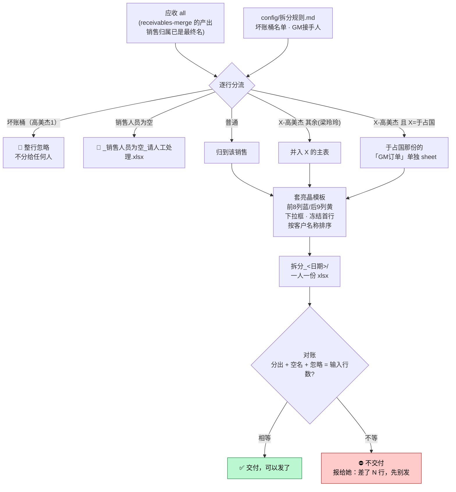

# 应收按销售拆分（split-by-sales）

> 一句话定位：一张「应收 all」→ 按销售人员拆成**一人一份**带下拉框的 Excel（亮晶版式）
> → 发给各销售填回。跑完**必对账**：分出 + 空名 + 忽略 = 输入行数。

## 1. 这个技能干嘛

应收账款合并出一张几千行的「应收 all」之后，要按销售人员拆成一人一份发下去，
让每个销售确认自己名下的账、填回收款进度。

拆分本身不难，难在**版式和口径**：每份要套亮晶姐的模板（前 8 列蓝 / 后 9 列黄 / 下拉框 / 冻结首行）、
坏账要剔掉、复合名字要归对人、还得对得上账不能丢行。

**它是链条的中间一棒**：`receivables-merge`（合并）→ **本技能（拆分）** →（后续）发给各销售填回。
销售归属在合并那步已经做完了，所以这一步**很少需要问人**。

## 2. 没有它的时候她怎么做（手工流程）

| 步 | 她手工怎么做 | 痛在哪 |
|---|---|---|
| 1 | 在 all 里按销售人员筛选 | 15 位销售，筛 15 次 |
| 2 | 每人的行复制到新工作簿 | **复制粘贴 15 次**，容易漏行错行 |
| 3 | 每份套模板：配色、下拉框、冻结首行 | **纯体力**，每份都要重做一遍 |
| 4 | 剔掉坏账桶、处理「X-高美杰」这类复合名 | 口径记在脑子里 |
| 5 | 数一数总行数对不对得上 | 对不上就得从头查 |

> 最容易出错的是**漏行**和**复合名归错人**。

## 3. 现在怎么用（人 + AI 怎么配合）

**她只需要做两件事**：给一张 all → 说一句话。

| 谁 | 做什么 |
|---|---|
| **她** | 说「**把 all 拆给各销售**」（文件在哪直接说，不用摆进固定目录） |
| **AI** | 认 all → 按销售分组 → 套模板生成每人一份 → **自动对账** |
| **AI** | 对账对不上 → **不交付**，报给她："对账差了 N 行，先别发，我查下" |
| **AI** | 有「销售人员为空」的行 → 单独出一份待人工，问她这些归谁 |
| **她** | 拿到 `拆分_<日期>/` 里的一人一份，直接发出去 |

**拆分口径**（`config/拆分规则.md`，改表不改码）：
- **坏账桶（高美杰1）整行忽略**，不分给任何人
- 名字「X-高美杰」**归到 X**；其中 GM_OWNERS（于占国）的高美杰行单独进「GM订单」sheet，其余（梁玲玲）并入主表
- 销售人员为空 → 单独出 `_销售人员为空_请人工处理.xlsx`
- 每人表**按客户名称排序**（同一客户归拢；亮晶姐 0620 定：销售 → 客户）

**AI 不许做的**：⛔ 对账不平还照常交付；⛔ 替她决定空销售的行归谁。

## 4. 一图看懂



## 5. 输入 / 输出

| 输入 | 处理 | 输出 |
|---|---|---|
| 一张应收 all（合并产出） | 分组 + 套模板 + 排序 + 对账 | `拆分_<日期>/` 一人一份 xlsx（+ 空销售待人工文件）+ 对账结果 |

## 6. 触发词

按销售拆分 / 拆应收 / 把 all 拆给各销售 / 拆分应收账款 / 一人一份应收表

## 7. 会变的在哪（改表不改码）

| 文件 | 改什么 |
|---|---|
| `config/拆分规则.md` | 坏账桶忽略名单、GM 单独成 sheet 的接手人 |

## 8. 怎么跑

```bash
python3 scripts/split.py --input <应收all.xlsx绝对路径> --date 0604
# --date 不给会自动从 all 文件名取（2026.6.4应收all → 0604），没日期才退回当天
# --out-dir 可省：给了具体 all → 输出在它同目录的 拆分_<日期>/
python3 tests/test_robustness.py     # 回归 12/12（合成假数据）
```

依赖：`python3 -m pip install openpyxl`

## 9. 验收口径

- 回归 **12/12 全绿**
- **真实 all 实测**（`2026.6.4应收all`，3243 行）→ 15 位销售、于占国含 GM订单 74 行、忽略 10 行，
  **对账 3233 + 0 + 10 = 3243 ✓**
- 链路验证：`receivables-merge` 产出 all → 本技能拆 → 对账对得上（实测通过）
- opencode 实测通过

## 10. 数据红线与已知边界

- 应收数据含客户名与金额，**只在本机跑、不进仓库**
- **只拆不发**：不自动发邮件给销售
- 归属正确性依赖上一棒——本技能只按 all 里已有的销售人员名分组，**不做归属判断**
