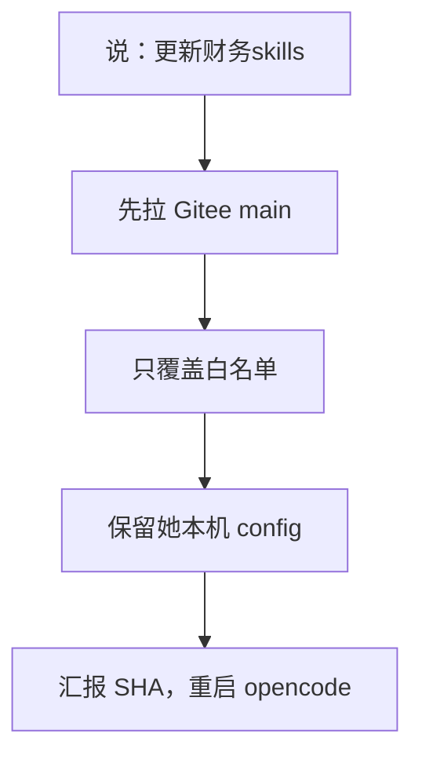

# 更新财务技能（update-finance-skills）

> 同事说「更新财务skills」就从 **Gitee** 拉官方包。核销已合入 main（李尚最新），更新时一并覆盖。

## 启动时说

对 opencode 说下面任一句：

- **推荐**：更新财务skills
- 也可：更新财务技能 / 更新技能包 / 拉最新 / 安装财务skills
- 问目录：有哪些财务技能 / 该用哪个技能 / 启动时说什么

## 这个技能干嘛

以前更新要粘一段很长的提示词，agent 还可能从 GitHub 旧克隆盖掉同事本机技能。现在这句话就对接 Gitee `Lee157/finance-skills` 的 `main`，只动白名单，保留本地 `config/`。

**核销（`ar-hexiao-daily`）**：李尚最新已合入 `main`，更新时覆盖（业务规则跟仓库）。`*.local.json` 不进仓。

## 一图看懂



## 怎么跑

```bash
python3 scripts/update.py
# 或指定目录
python3 scripts/update.py --dest ~/.config/opencode/skills
```

依赖本机 `git`。先 Gitee，不通再 GitHub。
