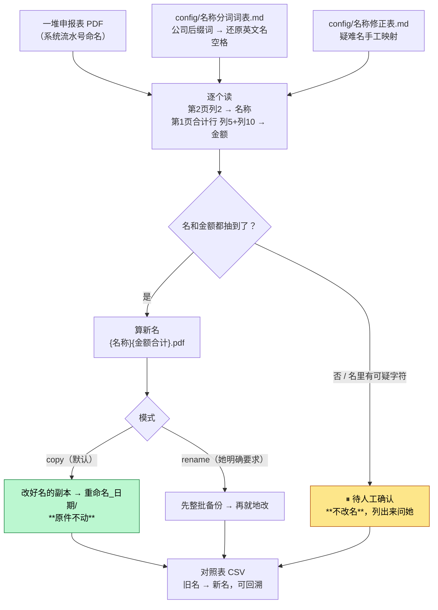

# 代扣代缴申报表批量重命名（withholding-report-rename）

> 一句话定位：一堆「代扣代缴、代收代缴税款报告表」PDF → 按 `{纳税人名称}{金额合计}.pdf` 批量改名。
> **默认只动副本、原件一个字节不改**，并出对照表；抽不出名/金额的**不瞎命名**，单独挑出来问人。

## 1. 这个技能干嘛

对外付款代扣代缴申报后，税务系统（自然人电子税务局/扣缴端）会导出一堆 PDF，
文件名是系统流水号，看不出是谁、多少钱。归档前要一个个打开、看清公司名和金额、再手工改名。

这批 PDF **结构固定**：2 页，第 1 页汇总、第 2 页明细，每份 = 一笔对外付款的代扣代缴记录。
本技能按固定位置把名字和金额抽出来，算好新名批量改。

**重命名规则**：`新名 = {被代扣代缴代收代缴纳税人名称}{计税依据合计 + 实代扣代缴税额合计}.pdf`

- 名称 → PDF **第 2 页**表格列 2（境外公司/个人名，单元格里被换行切碎，要合并 + 按业务词表还原空格）
- 金额 → PDF **第 1 页**合计行（含「合/总」字那行）列 5（计税依据）+ 列 10（实缴税额），相加、去尾零

例：`1,415.47 + 84.93 = 1500.4` → `LUCALIZE MANAGEMENT CONSULTANCIES CO.L.L.C1500.4.pdf`

## 2. 没有它的时候她怎么做（手工流程）

| 步 | 她手工怎么做 | 痛在哪 |
|---|---|---|
| 1 | 双击打开一个 PDF | — |
| 2 | 翻到第 2 页找公司名 | **英文名被换行切碎**，要自己拼回去还要还原空格 |
| 3 | 翻回第 1 页找合计行，把两个数加起来 | 手工加法，容易看错列 |
| 4 | 关掉、重命名、打开下一个 | **一份份重复几十次**，纯体力活 |

> 最容易出错的是**英文长名拼错**和**金额加错列**。

## 3. 现在怎么用（人 + AI 怎么配合）

**她只需要做两件事**：把 PDF 都放一个文件夹 → 说一句话。

| 谁 | 做什么 |
|---|---|
| **她** | 把这批 PDF 放一个文件夹，说「**把这批申报表按公司名+金额重命名**」 |
| **AI** | 逐个抽名 + 抽金额 → 算新名 → **复制**一份改好名放新文件夹 → 出对照表 CSV |
| **AI** | 抽不到名/金额、或名字里有可疑字符的 → **不改名**，单独列出来问她 |
| **她** | 看对照表；有没认出来的告诉 AI 正确名，或补进词表重跑 |

**默认走 copy 模式**：改好名的副本进 `重命名_<日期>/`，**原 PDF 原封不动**。
万一哪个名不对，原件还在、对照表能回溯。
只有她明确说「就地改」才用 `--mode rename`（脚本会先整批备份再改）。

**AI 不许做的**：⛔ 抽不出来就瞎猜一个名；⛔ 未经她说就地改原件。

## 4. 一图看懂



## 5. 输入 / 输出

| 输入 | 处理 | 输出 |
|---|---|---|
| 一个装着若干申报表 PDF 的文件夹 | 抽名 + 抽金额 + 分词还原 + 相加去尾零 | `重命名_<日期>/`（改好名的副本）+ `对照表.csv` + 待人工清单 |

## 6. 触发词

申报表重命名 / 代扣代缴报告表改名 / 把这批税款报告表 PDF 按公司名+金额重命名 / 给申报表批量改名 / 重命名代扣代缴 PDF

## 7. 会变的在哪（改表不改码）

| 文件 | 改什么 |
|---|---|
| `config/名称分词词表.md` | 公司后缀词（新后缀导致英文名黏在一起时补这里） |
| `config/名称修正表.md` | 疑难名手工映射（初始空） |

## 8. 怎么跑

```bash
python3 scripts/rename.py --input <PDF文件夹> --dry-run          # 先看会改成什么
python3 scripts/rename.py --input <PDF文件夹>                    # copy 模式（默认，安全）
python3 tests/test_rename.py                                     # 回归
```

依赖：`pdfplumber`（跑不起来说「配下环境」，交给 `env-doctor`）

## 9. 验收口径

- 回归 **5/5**：5 个样本 PDF → 5 个已知新名，逐字一致
- opencode 实测通过
- **待人工清单必须存在**：抽不到的宁可不改也不瞎命名

## 10. 数据红线与已知边界

- 申报表含境外供应商名与税额，**只在本机跑、不进仓库**
- 只处理这一种固定结构的报告表（2 页，第 1 页汇总 / 第 2 页明细）；换了模板要重验
- 默认不动原件；就地改必须她明确要求

## 术语

- **代扣代缴、代收代缴税款报告表**：税务系统导出的 PDF，每份 = 一笔对外付款的代扣代缴申报
- **计税依据合计 / 实缴税额合计**：第 1 页合计行的列 5、列 10，二者相加即文件名里的金额
- **被代扣代缴代收代缴纳税人名称**：第 2 页列 2 的境外公司/个人名
