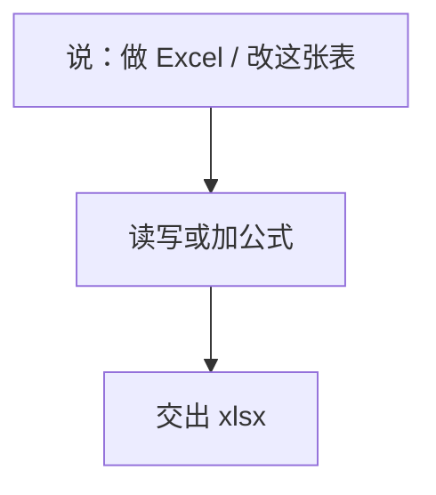

# xlsx · Excel 表格处理技能

**甲骨易财务部自研**通用文档技能（研发维护：李明昊，2026-06）。服务于财务同事在 opencode 上的日常 Excel 整理与小表制作，与 receivables-merge 等业务技能同属 `finance-skills` 技能包。

## 启动时说

- **推荐**：做 Excel / 改这张表
- 零散小活才用本技能。应收合并、拆分、核销等有专属技能，不要走这里。

## 一图看懂



零散小活才走这里。应收合并、拆分、核销有专属技能。

## 能干什么

- 读写 .xlsx/.xlsm/.csv/.tsv，加列、公式、格式、洗乱表
- 公式重算：`python3 scripts/recalc.py <文件.xlsx>`（走 LibreOffice）

## 结构

```
xlsx/
├── SKILL.md          # agent 行为指南 + 触发词
├── README.md         # 本文件
└── scripts/          # recalc.py、office 工具链
```

## 依赖（纯本地）

- Python：openpyxl、pandas
- 系统：LibreOffice（`soffice`，公式重算用）

## 维护

研发：李明昊 · 甲骨易财务部 · 改动走 `finance-skills` 仓库 `git push origin main`。同事说「更新财务skills」。不要再打 zip。